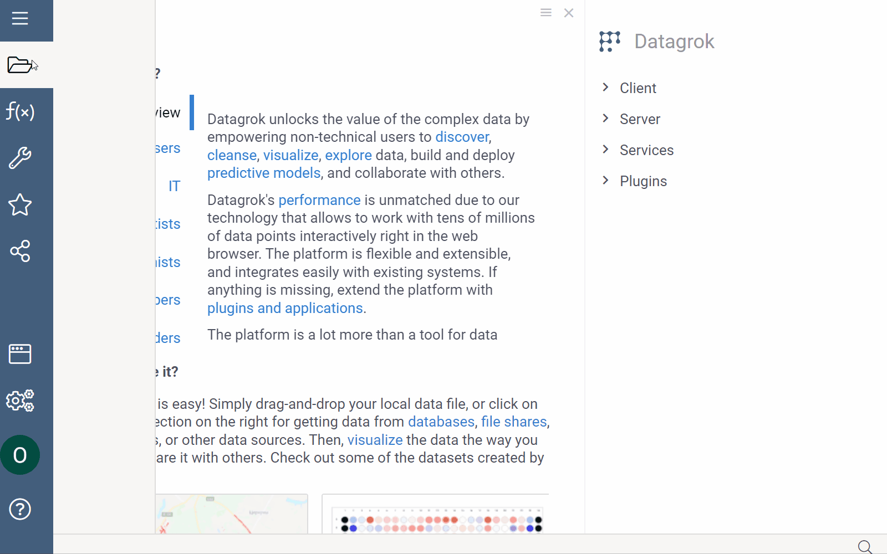
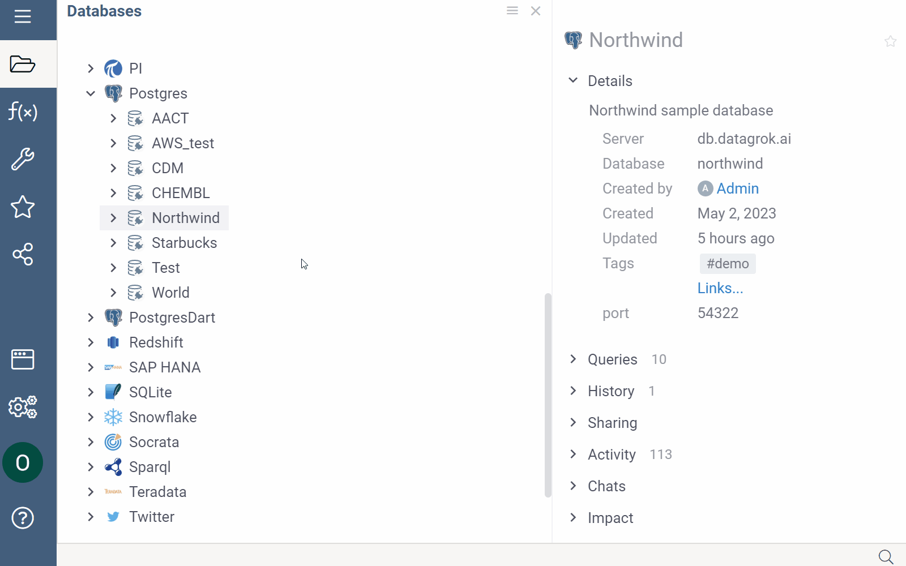
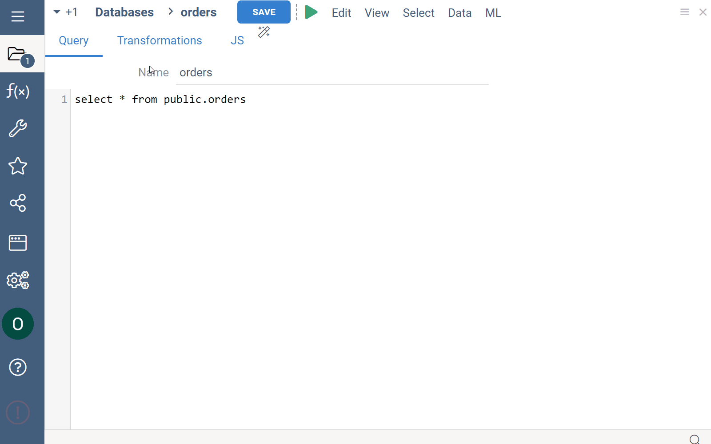
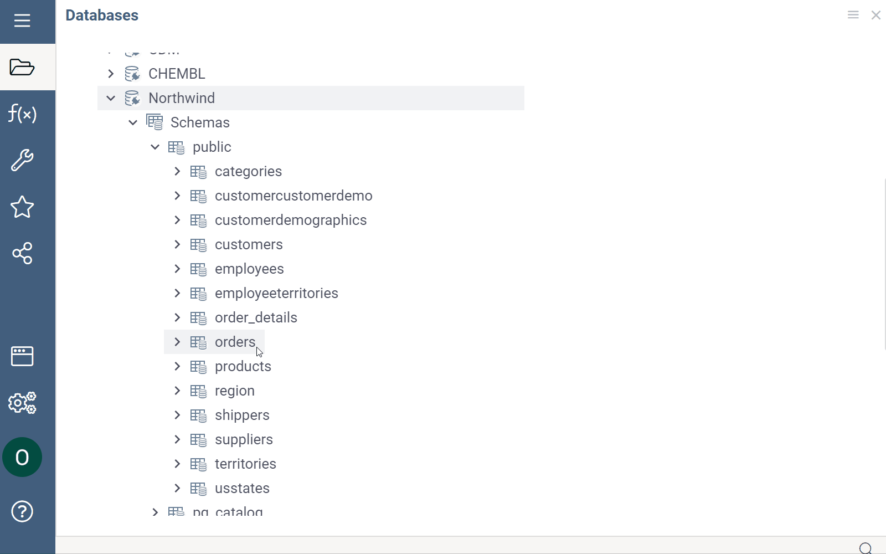
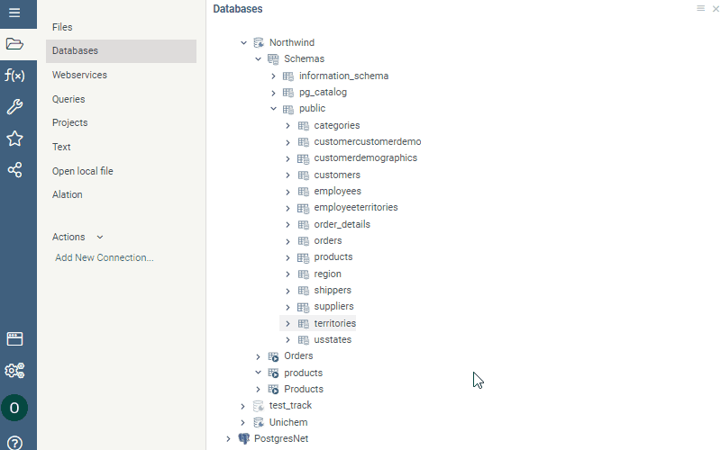
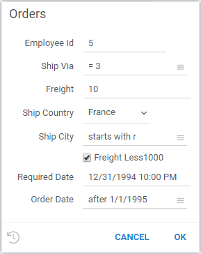
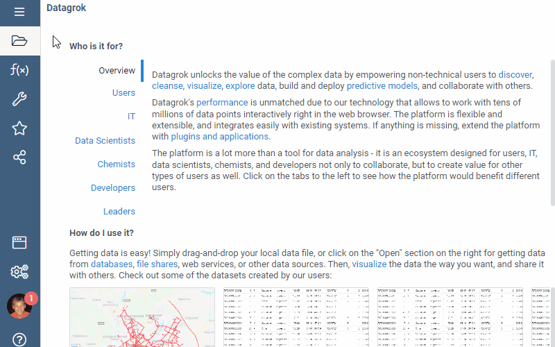
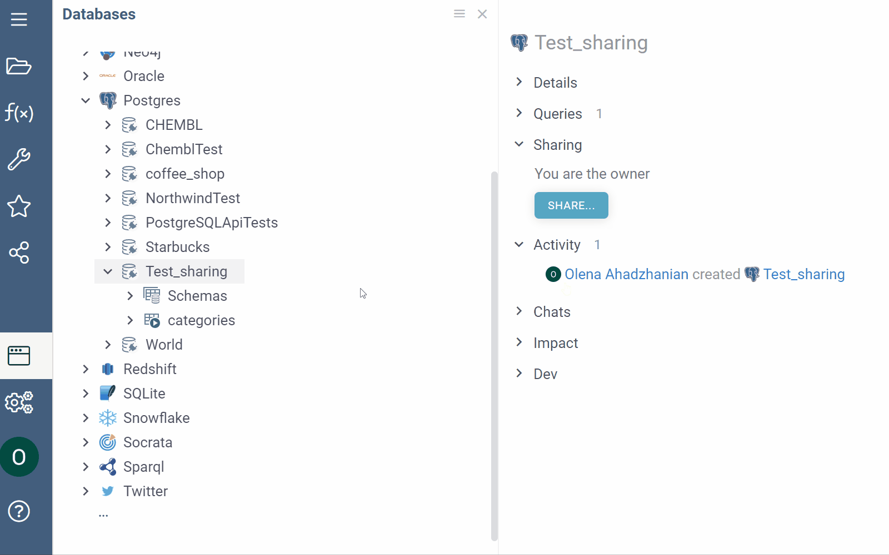

# Databases

```mdx-code-block
import Tabs from '@theme/Tabs';
import TabItem from '@theme/TabItem';
```

Datagrok has native support for relational databases ([30+ databases supported](supported-connectors.md)), allowing to do the following:

* Browse databases schemas, tables, and columns.
* Create and edit queries visually.
* Query databases using parameterized queries.
* Use query as a dynamically refreshed data source for dashboards.
* Share connections and queries with others.
* Configure user privileges.
* Create data pipelines.

:::note Developers

You can [create custom connectors](create-custom-connectors.md). You can also [connect to a data source, query data, and share connections programmatically](../develop/how-to/access-data.md/#connections).

:::

## Connecting to database

### Adding connection



To add a new connection, follow these steps:

1. Go to **Data > Databases**.
2. In the **Database Manager**, right-click the desired connector and select **Add connection…** to open the **Add new connection** dialog.
3. Fill in the connection parameters.
4. Click **TEST** to test the connection, then click **OK** to save it. If the connection fails, verify your connection details and that you added Datagrok's IP addresses to your allowlist.

:::note

Ensure your database is accessible from the Datagrok server, as the connection originates from there.

:::

Some connection parameters have unique characteristics, and it's important to specify them correctly:

* _JDBC connection_. For connections that support JDBC, you can use the `Conn. string` parameter to enter a custom JDBC connection string. Leave all other parameter fields empty. You still need to enter credentials.
* _Credentials_. You have two ways to specify credentials:
  * Manually. When entered manually, Datagrok stores secrets in
   a [secure privilege management system](../govern/security.md/#credentials). To specify who can change the connection credentials, click the **Gear** icon and select from the **Credential owner** dropdown.

  * Use the [Secrets Manager](data-connection-credentials.md#secrets-managers), such as the AWS Secrets Manager.

Upon successful connection, the database appears in the [Database Manager](https://public.datagrok.ai/connect) under the respective data source. By expanding the database, you can view its saved queries. [If connectors support it](supported-connectors.md), you can also inspect the schemas, tables, and columns of relational databases.

:::note

Like other objects in Datagrok, newly created connections are only visible to the user who created them. To let others access the connection, you must share it (right-click the connection and select **Share...** from the list of options).

:::

### Caching data

You can cache query results to improve query performance. To change caching options, right-click the connection, select **Edit...**, and then select the appropriate checkboxes in the **Edit** dialog:

1. **Cache Schema**: to speed up building the database schema.
1. **Cache Results**: to reuse results for all queries under this connection. To cache results of individual queries, edit that query's properties.

When you cache the query results, use the **Invalidate On** field to specify a [cron expression](https://www.freeformatter.com/cron-expression-generator-quartz.html) that defines when the cache is invalidated. Here is an example of a cron expression that invalidates the cache at 1 AM every night for a database that refreshes overnight: `0 0 1 * * ?`

:::caution

If you leave the **Invalidate On** field empty, the cache will never be updated.
This may be suitable when the data stored in the database remains static and never changes.

:::

:::note developers

You can cache data programmatically.

<details>

<summary> Caching package-defined connections </summary>

To cache package-defined connections, you can specify the `cacheResults` parameter in the connection json definition:

```json
{
  "name": "Northwind",
  "parameters": {
    "server": "dev.datagrok.ai",
    "port": 23306,
    "db": "Northwind",
    "cacheSchema": false,
    "cacheResults": true,
    "ssl": false,
    "connString": ""
  }
}
```

</details>

<details>

<summary> Setting cache options for queries </summary>

To cache the query results programmatically, edit the corresponding SQL file in the package queries and specify the `meta.cache` and `meta.invalidate` fields. These fields determine whether and how to cache the query results:

* `meta.cache` specifies whether the query is cached or not.
* `meta.invalidate` specifies when the cached result should be invalidated.

By setting these fields, you can control the caching behavior of individual queries and improve overall query performance.

<details>

<summary> Example </summary>

```Grok Script
--name: getProductNames
--input: string department
--meta.cache: true
--meta.invalidate: 0 0 1 * * ?
select distinct name from products p
where p.department = @department
```

</details>

</details>

:::

### Modifying connection

To modify a connection, right-click it and select **Edit...** from the list of options. To quickly create a connection similar to an existing one, right-click it and select **Clone...**

## Database Manager

**Database Manager** provides a hierarchical browsing interface for schemas and database objects, such as queries, tables, and table columns (if supported by the providers). You can perform various operations like adding new connections and queries, previewing data, running queries, and managing objects using context actions that are accessible through right-clicking an object. If you don't see a certain action, it may be due to insufficient permissions. Contact your Datagrok administrator for assistance.

The **Context Panel**, which is located to the right of the **Database Manager**, helps you work with database objects. Whenever you click an object within the **Database Manager**, the **Context Panel** displays the object's properties and context actions. For example, when you click a table, the **Context Panel** lets you view the table's metadata, dynamically preview the table's contents, run queries, and access other relevant information and options. To learn more about the **Context Panel**, see [Context Panel](../datagrok/navigation.md#context-panel).

:::note developers

**Context Panel** can be extended. You can add custom [info panes](../develop/how-to/add-info-panel.md) and [context actions](../develop/how-to/context-actions.md).

:::


### Schema Browser

The **Schema Browser** helps you explore all tables and columns belonging to a connection. To open a **Schema Browser**, in the **Database Manager** right-click a connection and select **Browse schema**.

Similar to the **Database Manager**, clicking an object in the **Schema Browser** updates the **Context Panel** with object-specific properties and actions. To open the object's context menu, right-click it.



### Viewing schema as dataframe

Another way to explore a database schema is through an [interactive spreadsheet](../visualize/viewers/grid.md). To access this feature, in the **Database Manager**, right-click a connection and select **Open schema as table**.

## Working with queries

Datagrok provides several tools for creating, exploring, and editing queries.

* _Editors_:
  * [Query Editor](#query-editor) is the main interface for executing database queries. Using this tool, you can write and edit statements in SQL and other languages and use functions to add post-processing steps.
  * [Aggregation Editor](#aggregation-editor) can be used for manipulating, summarizing, filtering, and pivoting table data.
* _Built-in queries for tables_:
  * **Get All**: retrieves all table data. Use it with caution.
  * **Get TOP 100**: retrieves the first 100 rows.

  :::tip

  To retrieve specific columns, hold down the Shift key on your keyboard while clicking the desired columns in the schema. Once selected, right-click the selection and run **Get All** or **Get TOP 100** just for these columns.

  :::

* [_Join tables_](#join-tables): This tool lets you merge multiple tables within a database connection.

:::note

  The ability to query tables is connector-specific and may not be available for all.

:::

When you successfully create a query, it appears in the **Database Manager** under the corresponding connection or table. From there, you can run it, share it with others, manage access, and perform other tasks.

:::tip

To see all queries belonging to a connection, right-click it and select **Browse queries** from the list of options.

:::

### Query Editor

**Query Editor** is the main interface for executing database queries. To open it, right-click a database connection or a table and select **Add query** (for connections) or **New SQL Query...** (for tables).

The **Query Editor** has two tabs:

<Tabs queryString="query-editor">
<TabItem value="query" label="Query" default>

This tab is where you write and edit queries. As you work on your query, you can preview the query output at any time by clicking the **Run/Refresh** button on the menu ribbon or by pressing the F5 key on the keyboard. The query result is displayed in the bottom part of the editor as an interactive dataframe. In the dataframe, you can view object details, perform actions on columns, and more.

When your query is complete, give it a name and click the **Save** button. If you don't want to save the query, close the editor without saving.


:::note

You can also add the query results to the workspace for further analysis. To do so, click the **Dropdown Arrow** control in the bottom left corner of the **Query** tab and select **Add results to workspace**.

:::

</TabItem>

<TabItem value="transformations" label="Transformations" default>

Use this tab to apply post-processing operations to your query:



1. Select a function to apply to a query. Use checkboxes next to the operation categories to filter.
1. Set the function parameters in the dialog that opens.
1. Click **OK**.
1. Repeat the steps as needed.

Each transformation is recorded. To see the results of each record, locate the record on the left and click it. The data output for this step is displayed in the **Preview** section.

You can also edit or remove transformation records as needed. To edit a transformation step, click the **Dropdown Arrow** control next to the transformation record and select from the list of options. To remove the transformation record entirely, click the **Delete** (**x**) icon.

:::tip

Use the menu ribbon on top to add or remove columns quickly.

:::

:::note Developers

You can create custom transformation functions in R, Python, or any other language. See [Scripting](../compute/scripting.md).

:::

</TabItem>
</Tabs>

### Aggregation Editor

**Aggregation Editor** is a visual tool for summarizing and pivoting table data. To open it, right-click a table in the **Database Manager** and select **Aggregate data**.

The **Aggregation Editor** has two tabs: **Queries** and **Transformations**. The **Transformations** tab works similarly to the [Query Editor](#query-editor)'s tab and lets you add post-processing steps.

To aggregate data, use the **Query** tab. Here, you can choose which columns to include in your report and decide how to pivot and group them. You can show one or multiple aggregated values for rows, for example, average sales and headcount by country. Additionally, you can pivot rows into columns to show one or more aggregated values for each column. You can also perform both actions to produce a pivot table that shows an aggregated value for every intersection of rows and columns.

* **Group by**: Use this field to specify columns to be used for grouping rows. To do so, click the **Add** (**+**) icon and select the desired column from the list. The chosen column then acts as a key, with its unique values serving as row identifiers. You can add multiple columns.
* **Pivot**: Use this field to specify the rows that you want to show as columns. To do so, click the **Add** (**+**) icon and select the desired column from the list. You can pivot one or more columns.
* **Aggregate**: Use this field to add aggregated values. First, click the **Add** (**+**) icon and select the column you want to aggregate. Datagrok automatically applies a default aggregating function based on the data type: _average_ for numerical data and _count_ for categorical data. To change the aggregating function, right-click the column, select **Aggregation**, and choose your preferred function from the list. Each column can only have one aggregating function, but you can add multiple columns or the same column with different aggregating functions.

  :::note

  If you add columns only to the **Aggregation** field without adding any columns to the **Group by** or **Pivot** fields, the resulting query returns a single row that shows the total aggregate values for each column added in the **Aggregation** field.

  :::

* **Filter**: Use this field to filter the results using the pattern syntax. To do so, click the **Add** (**+**) icon, select the column to which you want to apply the filter, then set the condition (see [parameter patterns](#parameterized-queries) for syntax).



As you work on your query, you can preview the query output as an interactive dataframe. In the dataframe, you can view object details, perform actions on columns, and more. When your query is complete, give it a name and click the **Save** button. If you don't want to save the query, close the editor without saving.

### Join tables

Use this tool to merge tables:

  1. Right-click a table and select **Join tables**. This action opens a dialog with a list of columns connected by keys.
  1. Select the checkboxes that correspond to the columns you want to include. Based on your selections, Datagrok automatically generates an SQL statement and a preview of the results. If desired, you can manually modify the SQL statement. The preview will update accordingly as you make changes.
  1. When finished, use the **Dropdown Arrow** control in the bottom left corner of the dialog to choose between the two options:
     * **Save as query**: This opens the **Query Editor** where you can further edit the query.
     * **Add result to workspace**: This opens the query output as a dataframe for detailed exloration.



### Parameterized queries

In Datagrok, queries are functions. Like with JavaScript functions, you can add metadata to a Datagrok function at the function level or the parameter level. This metadata can include things like the function's name, connection details, caching options, and more. At the parameter level, you can specify metadata such as the parameter's name as it should appear in the user interface, its semantic type, input type, and so on. To define query parameters, use SQL/Sparql comments in the query header : `--` for SQL, and `#` for Sparql. The syntax for defining query parameters is based on [scripting](https://datagrok.ai/help/datagrok/functions/func-params-annotation), with additions specific to queries.

When you want a query to ask for input every time you run it, you can create a _parameterized query_. This type of query relies on one or more parameters, which are placeholders for input values. When you run a parameterized query, Datagrok autogenerates a parameter dialog, prompting you to enter the relevant parameter values. By doing so, you can
use the same query to retrieve data that matches different criteria.

#### Query parameters

The syntax for defining query parameters is based on [functions syntax](../datagrok/functions/func-params-annotation.md)
with additions specific to queries.

Queries have a special `connection` parameter corresponding to the query connection name. It is optional, just like the
rest of parameters.

Another addition is the `list<T>` parameter type. It denotes a list of objects of type `T`. Currently only strings are
supported. You can add an input/output of type `list<string>`.

#### Add a parameter

1. Right-click a query and select **Edit**. A **Query View** opens.

2. In the **Query** tab, annotate parameters in the box provided using SQL/Sparql comments. Use `--` for SQL and `#` for
   Sparql.
   > Example:
   >
   >```sql
   >--input: string productName
   >select * from products where productname = @productName
   >```

3. Click **Save**.

#### Input parameters

To define input parameters for your SQL query, use the `--input` annotation followed by the parameter's data type, name, default value, and any additional options. You can also include a brief description of the parameter that will appear in the UI:

`--input: <type> <name> = <value> {<option>: <value>; ...} [<description>]`

Supported parameter types include `integer`, `float`, `boolean`, `string`, `DateTime`, and `list<T>` (a list of parameter type `T`, currently supports the `strings` type only). [Additional options](https://datagrok.ai/help/datagrok/functions/func-params-annotation#options) are based on the parameter type, and may include _choices_, _suggestions_, and _validators_.

For example, to create a string input parameter for a _ship country_, you can use the following code snippet:

```
--input: string shipCountry = "France"
SELECT * FROM customers where shipCountry = @country
```

Here, the input parameter is called `shipCountry` and has a default value of `France`.

You can also use lists to pass multiple values for a single parameter. For example, you can use lists to retrieve data for a specific set of users or analyze sales data for a particular country. To use lists in queries, you can specify `list<T>` as the parameter's data type and wrap its use inside the SQL query into `= ANY(p)`, or a similar operator with an alternative selection of the comparison type, such as `>= ANY` or `< ANY`. Here's an example:

```
--input: list<string> shipCountry = ['France', 'Italy', 'Germany']
SELECT * FROM Orders WHERE shipCountry = ANY(@shipCountry)
```

This query returns all records from the `Orders` table where the `shipCountry` column matches any of the values in the `shipCountry` list.

To help users build queries more quickly and accurately, or for more complex queries, you can also use _choices_, _suggestions_, and _validators_. _Choices_ allow users to select from a predefined list of values for a given parameter, _suggestions_ provide users with auto-complete suggestions based on what they type in the input field, and query _validators_ validate the query without executing it.

You can define _choices_ using a comma-separated list of values, a name of another query, or by writing an actual SQL query. Here's an example of how to define _choices_ for a _ship country_ input parameter using all three methods:

```sql
--input: string shipCountry = "France" {choices: ['France', 'Italy', 'Germany']}
--input: string shipCountry = "France" {choices: Demo:northwind:countries}
--input: string shipCountry = "France" {choices: Query("SELECT DISTINCT shipCountry FROM Orders")}
```

:::tip

Parameter's choices, validators, and suggestions can depend on the value of another parameter. This is useful when creating queries with hierarchical choices, where each subsequent parameter depends on the previous one. To do this, specify the input parameter you want to reuse and its default value, if applicable. Then, define the choices query using the `Query()` function and reference the input parameter using the `@` symbol.

<details>
<summary> Here's an example </summary>

```sql
--input: string state = "NY" {choices: Query("SELECT DISTINCT state FROM public.starbucks_us")}
--input: string city = "Albany" {choices: Query("SELECT DISTINCT city FROM public.starbucks_us WHERE state = @state")}
SELECT * FROM public.starbucks_us WHERE (city = @city)
```

Here, the `state` and `city` parameters are defined as strings with default values. The `city` parameter's choices query references the `state` parameter using `@state`. This ensures that the choices are filtered based on the value of `state`.

</details>

:::

To define _suggestions_ or _validators_, provide the name of the function that will be executed to generate suggestions or validators as the user types a value.

A special query input type is a _search pattern_ that allows you to enter free-text conditions that are then transformed into proper SQL clauses, for instance "this week" for a date column, or "> 50" for a numerical column.

To use search patterns, set the input parameter's data type to `string`. Then, specify the actual data type in the `pattern` _option_. To reference the search pattern that will be used against the specified column, use `@<patternName>(columnName)`.

Here's an example of a numerical pattern for filtering the "freightValue" column:

```
--input: string freightValue = >= 10.0 {pattern: double}
select * from Orders where @freightValue(freight)
```

In this example, the `freightValue` input parameter is defined as a string with a default value of `>= 10.0`. The `pattern` _option_ specifies that the actual data type is a `double`. In the query, a reference to `@freightValue(freight)` specifies the _pattern_ that will be evaluated against the "freight" column.

Here's a list of all supported search patterns:

<details>
<summary> Patterns </summary>

| Type               | Value         | Description or example       |
|--------------------|---------------|------------------------------|
| `num, int, double` | `=`           | `= 100`                      |
|                    | `>`           | `> 1.02`                     |
|                    | `>=`          | `>= 4.1`                     |
|                    | `<`           | `< 5`                        |
|                    | `<=`          | `<= 2`                       |
|                    | `in`          | `in (1, 3, 10.2)`            |
|                    | `min-max`     | `Range: 1.5-10.0`            |
| `string`           | `contains`    | `contains ea`                |
|                    | `starts with` | `starts with R`              |
|                    | `ends with`   | `ends with w`                |
|                    | `regex`       | `regex 1(\w+)1`              |
|                    | `in`          | `in (ab, "c d", "e\\"f\\"")` |
| `datetime`         | `anytime`     |                              |
|                    | `today`       |                              |
|                    | `this week`   |                              |
|                    | `this month`  |                              |
|                    | `this year`   |                              |
|                    | `yesterday`   |                              |
|                    | `last week`   |                              |
|                    | `last month`  |                              |
|                    | `last year`   |                              |
|                    | `before`      | `before July 1984`           |
|                    | `after`       | `after March 2001`           |
|                    | `min-max`     | `Range: 1941-1945`           |

To learn more, see [search patterns](../explore/data-search-patterns.md).
</details>

#### Output parameters

Output parameters define how the query output is presented. By default, a query's result is returned as a dataframe. You can specify a different data type in the output parameter. The following types are supported: `int`, `float`, `string`, `bool`, `map`. Here's an example from the [Chembl](https://github.com/datagrok-ai/public/tree/master/packages/Chembl) package, where the query returns a string of the semantic type `Molecule`:

```sql
--output: string smiles {semType: Molecule}
```

## Running queries

To run a query, locate the query in the **Database Manager** and double-click it. For parameterized queries, Datagrok automatically generates a parameter dialog that prompts you to enter values for the input parameters. The input parameters are then substituted for inputs from the UI controls, allowing you to create complex queries with dynamic choices that are easy to use and maintain.

Here's an example of a parameterized query with several input parameters and _options_:

<Tabs>
<TabItem value="patram-query" label="Parameterized query" default>

```sql
--input: int employeeId = 5
--input: string shipVia = "=3" {pattern: int}
--input: double freight = 10.0
--input: string shipCountry = "France" {choices: Query("SELECT DISTINCT shipCountry FROM Orders")}
--input: string shipCity = "starts with r" {pattern: string}
--input: bool freightLess1000 = true
--input: datetime requiredDate = "1/1/1995"
--input: string orderDate = "after 1/1/1995" {pattern: datetime}
SELECT * FROM Orders WHERE (employeeId = @employeeId)
    AND (freight >= @freight)
    AND @shipVia(shipVia)
    AND ((freight < 1000) OR NOT @freightLess1000)
    AND (shipCountry = @shipCountry)
    AND @shipCity(shipCity)
    AND @orderDate(orderDate)
    AND (requiredDate >= @requiredDate)
```

</TabItem>
<TabItem value="parameter-dialog" label="Parameter dialog">



</TabItem>
</Tabs>

:::note developers

To run a query programmatically, see this [code snippet](https://public.datagrok.ai/js/samples/data-access/parameterized-query). Learn how to [expose the parameter dialog to end-users as an application](../develop/how-to/create-package.md).<!--Mention?: when the cartridge is not deployed on that particular database, the query returns an error-->

:::

After running a query, you typically get back a dataframe. You can perform various operations on this dataframe, such as data cleansing, transformation, [and more](../visualize/viewers/grid.md). All of these actions get recorded as macros, and will be replayed when the query is re-executed. Once you have the data set up to your satisfaction, you can add viewers and create a visualization.

To view the queries you've created or those shared with you, you can use the **Queries Gallery** (**Data** > **Queries**). This gallery provides a convenient interface to quickly access and manage queries. You can search queries by their name or tag and use the **Context Panel** to view information and actions for the selected query.

## Creating dynamic dashboards for query results

You can create and publish dashboards that query data from a database and then present it in a visual layout. For parameterized queries, these dashboards can be dynamic, allowing dashboard users to change the query parameters right inside the dashboard to refine search criteria and interact with data in real-time.

To save the query output as a dynamic dashboard, do the following:

1. Run a query to open a dataframe and create a desired view of the query output.
1. On the **Sidebar**, click **Projects** > **Upload**.
1. In the **Upload project** dialog, enter a name and description (optional) in the fields provided.
1. Select how to store data:
    * Save the data as a static snapshot.
    * Store the data as a generation script by toggling the **Data sync** control. The query re-executes each time the project is opened. To learn more about dynamic data updates in projects, see [Dynamic data](../datagrok/project.md/#dynamic-data).
1. Click **OK** to upload the project.
1. [Share](#sharing-query-results) the project with others.



## Sharing query results

You have two options to share query results in Datagrok:

* Share its URL
* Share it as a project.

Each query output has a unique URL, which has all the information needed to recreate the query, including its parameters. This is especially useful for parameterized queries, where you can embed the query output on external websites with specific parameters applied. After you have executed a query, copy the URL from the address bar and share it with others. When this URL is accessed, a query gets re-executed, so the query output always displays the latest data. When the users open the report, they can still change the query parameters in the **Toolbox** on the left.

:::note

To access the query results from the link provided, users must have the necessary permissions to execute this query.

:::

If you want to persist a specific layout, create a dynamic dashboard, or assign access permissions to specific groups or users, you can share query results as a project. First, you need to [upload the project](#creating-dynamic-dashboards-for-query-results). Then, locate the desired project in **Data** > **Projects** and right-click it to share. Users will get an email notification with the access link. To learn more about access privileges, see [Access control](#access-control).

## Access control

In Datagrok, certain objects called _entities_ have a [set of operations](../datagrok/objects.md) that can be applied to them. These entities are connections, queries, tables, and table columns, all of which can be shared, assigned permissions, annotated, and more.

When you create an entity such as a connection or a query, it's private and visible to you only. To make it accessible to others, you can share it.

To share:

1. Right-click the connection or a query you want to share and select **Share...**.
2. In the **Share** dialog, enter a user or a group that needs access and set corresponding permissions. These privileges can be given to users or to [groups](../govern/group.md). For more information on the access privilege model, see [Privileges](../govern/security.md#privileges).
3. Optional. Add a description in the provided text field. If you don't want to notify the recipients, clear the **Send notification** checkbox.
   :::note

   If you enter the name of a user or a group, they are notified through the Datagrok interface. To share an object with a user who doesn't have a Datagrok account, enter their email address. They will receive an email notification containing a link to the shared object and the entered description. After they sign up for a Datagrok account, they will be able to access the shared object.

   :::

4. Click **OK** to share.



If you can't share a connection or a query, you may have insufficient permissions. Contact your Datagrok administrator for assistance.

:::tip

Use the **Context Pane** on the right to inspect and quickly adjust access permissions to your databases, manage queries, view history and activity details, send comments to those you're sharing with, and more.

:::

:::caution important

Datagrok query belongs to the database connection for which it's created. It means you can’t share a query without sharing a connection. Deleting a connection also deletes a query.

:::

## Resources

* Videos
  * [Database exploration](https://www.youtube.com/watch?v=YJmSvh3_uCM)
  * [Parameterized queries - Overview](https://www.youtube.com/watch?v=dKrCk38A1m8&t=1980s)
  * [Parameterized queries - Example](https://www.youtube.com/watch?v=sSJp5CXcYKQ)
  * [Using lists in parameterized queries](https://www.youtube.com/watch?v=meRAEF7ogtw)
* Tutorials
  * [Adding parameters to functions](../datagrok/functions/func-params-enhancement.md)
