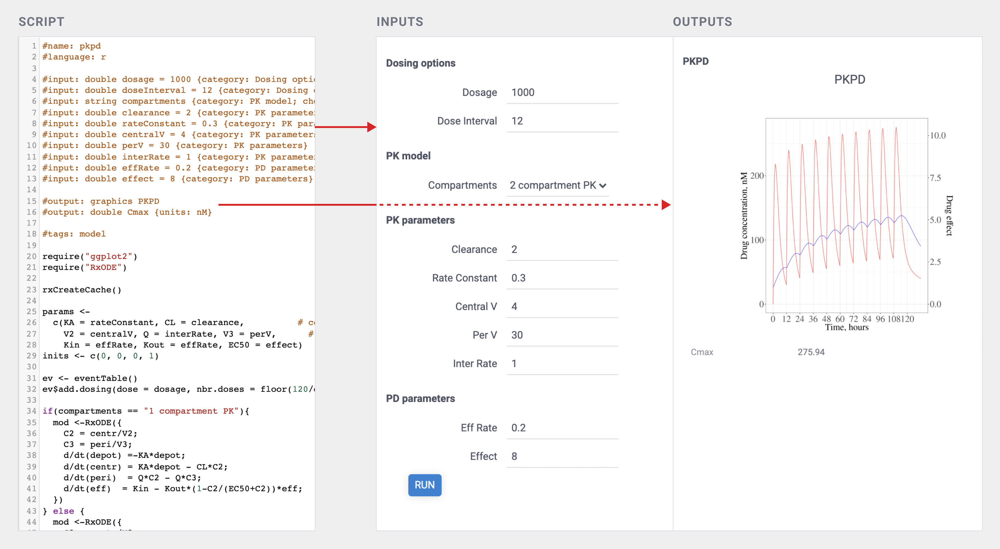
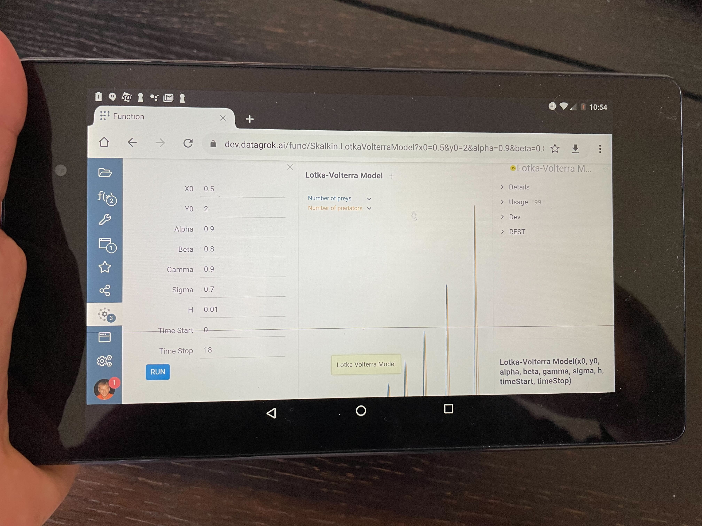
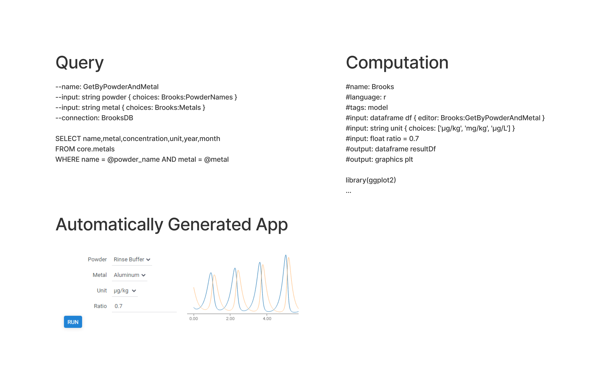
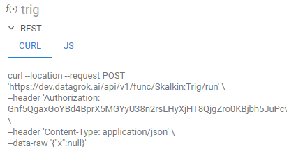
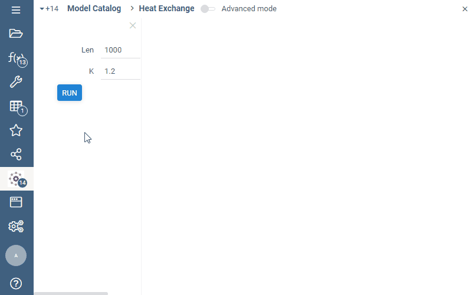

# Compute

A next-generation environment for scientific computing. 
It leverages a number of the core Datagrok features, such as 
[in-memory data engine](../develop/performance.md#in-memory-database),
[interactive visualizations](../explore/exploratory-data-analysis.md),
[data access](../home.md#access),
[machine learning](../home.md#learn),
and [enterprise features](../home.md#deploy-and-integrate)
to enable developing, publishing, discovering, and using scientific applications:

1. [Cross-language support](#cross-language-support)
2. [Scalable computations](#scalable-computations)
3. [Web-based UI](#user-interface) that could be [autogenerated](#autogenerated-ui), 
[customized](#custom-ui), [templatized], and [used on mobile devices]
4. [Deployment](#deployment) with [model versioning](#versioning) and support for [environments](#environment)
5. [Data access](#data-access)
6. [Metadata]
7. [Integration](#integration): [REST API](#rest-api), [JS API](#js-api), [embedding as iframe](#embedding)
8. [Leveraging the platform](#leveraging-the-platform)
   1. [Logging, audit, and traceability](#logging-audit-and-traceability)
   2. [Privileges and visibility](#privileges-and-visibility)
   3. [Usage analysis]()
   4. [Exploratory data analysis](#exploratory-data-analysis) and [Jupyter notebooks](jupyter-notebook.md)
9. [Roadmap]
   1. [Repository of curated scientific methods]


* Composable (an output of one function becomes an input to the other)
* Could be connected to any data source (db, web service, file, etc)
* Logging, audit, traceability
* Privileges and visibility

`Compute` package:

* Enables a full lifecycle of models: create, tune, share, use, validate
* Provides for easy to use and highly automated evaluation and computation environment
* Enables contextual process for the Design of Experiment (sensitivity analysis and more)

In addition, Datagrok platform supports a UI layout markup, so that the model function becomes
a GUI-rich application with no manual coding.

Project planning board: [link](https://github.com/datagrok-ai/public/projects/8).

## Cross-language support

The basic unit of execution is a [function](https://datagrok.ai/help/overview/functions/function),
which could be written in [any language that Datagrok supports](https://datagrok.ai/help/compute/scripting)
, such as `Python`, `R`,
`Julia`, `Matlab/Octave`, `JavaScript`, and others. No matter which language is used, 
each function has the following properties:
* Advanced support for input and output parameters
  * Typed (cross-language support for scalars, vectors, dataframes, images)
  * Intraspectable
  * Metadata-annotated
* Dynamic discovery
* Polymorphic execution (platform doesn't care which language the function is implemented in)
* Function-level [metadata]

These properties unlock plenty 
of interesting features covered below, such as 
[scalable computations](#scalable-computations), 
[reproducibility],
[automatic UI generation](#autogenerated-ui),
[audit], 
[sensitivity analysis], 
[optimization], and others.

## Scalable computations

Depending on the underlying language, a function could be executed on the client side,
server side, both, or either.

`JavaScript` and `C++` (compiled to [WebAssembly](https://webassembly.org/)) could be executed
right in the browser. The upside to that is unmatched responsiveness, data locality, and 
computation locality. The downside is that many of the popular statistical and modeling
methods are not currently available in these languages yet. Note that while the computations are
performed locally, the proper audit and traceability still works (both input and output
parameters could be sent to the server for historic reasons).

`R`, `Python`, `Julia`, `Matlab`, and `Octave` are powerful languages with the mature
ecosystem of scientific libraries, and existing models implemented previously inside the
organization. They could only be executed on a server, and as such
the question of scalable computation arises. Datagrok takes care of that by using the
`message queue` architecture. When each server-based function is invoked, its parameters
are saved to a queue; one of the worker processes then picks a task (such as running a Python
function), executes it, and puts the results back. This architecture guarantees the following:

* The platform won't get overloaded by trying to execute too many tasks at once
* Scaling is as simple as adding more workers (which could be hosted externally if necessary)
* A queue serves as a basis for [logging, audit, and traceability](#logging-audit-and-traceability)

## User interface

Our goal is not computations for the sake of it, but
rather helping **users** derive actionable insights, and support the decision-making process.
The UI should be as easy to use as possible, tailored to the user needs, and 
be specific for the tasks. On the other hand, it should be clean, universal, and easy enough
to be developed by a scientist without a deep understanding of the Datagrok platform.
To satisfy these seemingly contradictory requirements, we developed a hybrid approach to
building the UI, where the model author has full control over choosing how custom the UI
for the speficic model should be. In the most standard case, there is no need to write 
a single line of code, as the UI is 
[automatically generated](#autogenerated-ui) based on the function signature.
On the other end of the spectrum, you have the possibility to take everything in your own
hands and develop a completely [custom UI](#custom-ui). Anything in between is also possible.

### Autogenerated UI

Very often, all that is needed for the model UI are the input fields for the 
corresponding function's parameters. In this case, Datagrok generates the UI automatically
by constructing the corresponding input fields and output area with graphics and results, 
and bringing it to life by making it interactive. Additional parameters' metadata, such
as units, category, description, input type (slider/combo box/etc), and others 
are also taken into account.

The following picture demonstrates a working PK/PD model implemented in R 
with the autogenerated UI (look at the script header area for details). While it looks
very similar to the traditional Shiny app, the R script does not have to deal with 
the UI at all, which not only simplifies the development and maintenance, but also
provides for the uniform experience.



A visual tool for annotating function parameters is
[currently in the development](#https://github.com/datagrok-ai/public/issues/184).

Learn more: [function parameters](https://datagrok.ai/help/overview/functions/func-params-enhancement)

See also: [auto-generating UI for dynamic data retrieval](#data-sources)

### Custom UI

On the other side of the spectrum, if necessary the UI could be developed 
from scratch without any limitations, using either vanilla JavaScript, 
a framework of your choice such as React, or 
[Datagrok UI toolkit](../develop/js-api.md#ui). No matter what 
you choose, Datagrok [JS API](https://datagrok.ai/help/develop/develop) could always be used.

### Mobile devices

Datagrok UI is web-native, so it is possible to use the platform on mobile devices, including 
performing computations on the client side. Even in the current state with no mobile-specific
UI optimizations performed, the platform is already usable. This allows for a $100 tablet 
to be duct-taped on the instrument in the lab and run a simulation specific to that
instrument - a truly innovative, affordable, and fit-for-purpose solution! 

Here's Andrew running the client-side Lotka-Volterra Model on the underpowered Nexus 7 from 2012:



## Deployment

In the simplest case, deploying a model is saving a script with the `#model` tag - the platform 
takes care of the rest. It could be done either manually via the UI, or automatically

For the **manual** deployment, choose `Functions | Scripts | New R script`, 
paste the script in the editor area, and hit `SAVE`.

**Automatic** deployment

Together with the [script versioning](#versioning) and [script environmets](#environment) features
outlined below, this enables [reproducibility of results]

### Versioning

As most Datagrok objects, models are versionable, meaning that all the sources for the previously
used versions are available, along with the [audit](#logging-audit-and-traceability) trail of the changes.

### Environment

Scripts could specify the required [environment](../compute/scripting.md#environments), 
such as libraries used, their versions, versions
of the language interpreter, etc. We use 
[Conda environments](../compute/scripting.md#conda-environments) for Python, and 
[Renv environments](../compute/scripting.md#conda-environments) for R.

## Data access

The platform allows to seamlessly [access](../home.md#access) any machine-readable data source,
such as [databases](../access/data-connection.md),
[web services](../access/open-api.md),
[files](../access/importing-data.md) (either on network shares on in S3).
To make a model retrieve the input data from the data source, annotate the
input parameter with the corresponding [parameterized query](../access/parameterized-queries.md).
Since both queries and models are functions, the platform can automatically generate
the UI that would contain both input- and computation-specific parts. 

By untangling the computation from the data access, implementing both of them as
pure [functions](https://datagrok.ai/help/overview/functions/function), and eliminating the 
hardcoded UI altogether, we can now create powerful, interactive scientific application 
without having to write a single line of the UI code. These applications also automatically benefit from
all other cross-cutting features.

The following examples illustrates it. Suppose we want to develop an R-based simulation against the freshest data from the database.
This would require two steps: 
[creating a parameterized query](../access/parameterized-queries.md), 
and creating a computation script.

Query:
```
--name: GetByPowderAndMetal
--input: string powder { choices: Brooks:PowderNames }
--input: string metal { choices: Brooks:Metals }
--connection: BrooksDB
SELECT name,metal,concentration,unit,year,month 
FROM core.metals 
WHERE name = @powder AND metal = @metal
```

Computation:
```
#name: Brooks
#language: r
#tags: model
#input: dataframe df { editor: Brooks:GetByPowderAndMetal }
#input: string unit { choices: ['µg/kg', 'mg/kg', 'µg/L'] }
#input: float ratio = 0.7
#output: dataframe resultDf
#output: graphics plt
```

End result:



Parameterized queries work via Datagrok's [data access](../access/data-connection.md) mechanism,
allowing you to benefit from other access-related features:
* [Result caching](../access/data-connection.md#caching) (very useful when working with data that changes overnight)
* [Visual table query builder](../access/table-query-view.md)
* [Visual schema query builder](../access/query-builder.md)
* [DB explorer](../access/db-exploration.md)

## Analytical blocks

No matter which domain you are working with, which language your program in, 
or what type of model you build, quite often you need the same set of tools (including visual tools) to
efficiently work with data. Naturally, it makes sense to implement these algorithms 
just once, and then use them everywhere. Here are some examples:    

1. Imputation of missing values
2. Outlier detection
3. Multivariate analysis
5. Time series analysis
6. Validators

The fact that the typical analysis is an introspectable workflow consisting of functions
passing the data helps us deal with that in a declarative manner. 

# Integration

Datagrok was designed with the design goal to be as extensible and easy to integrate with
as possible, so out-of-the box we get many platform integration capabilities such as
authentication, data access, and many others. In addition to that, there are some 
capabilities specific to models: [REST API](#rest-api) and 
[embedding as iframe](#embedding-as-iframe).

## REST API

Once registered, each function gets assigned a REST API endpoint that allows external
code to execute it by passing the input parameters, along with the authentication token.
This allows instantaneous deployment of scientific methods for external consumption.
To find our how to use it, click on the function and expand the `REST` pane on the
property panel on the right. Both JavaScript and Curl samples are provided.



## JS API

JavaScript-based apps have access to the whole Datagrok platform via the
[JS API](../develop/js-api.md).

## Embedding as iframe

Sometimes, an app has to be included in the external web page. The simplest way to
achieve it is via the [iframe](https://www.w3schools.com/tags/tag_iframe.ASP)
element. 

**Note:** at the moment, only viewer-based embedding is supported; here is the
[corresponding ticket](#https://github.com/datagrok-ai/public/issues/211)

# Leveraging the platform

The computation engine utilizes the power of the Datagrok platform, which brings plenty 
of benefits:
* Not having to reimplement the wheel
* Users don't have to switch tools anymore

## Logging, audit, and traceability

Out-of-the box, the platform provides audit and logging capabilities, and when the model
is [deployed](#deployment), we get the following automatically:

* See who created, edited, deployed, and used the model
* Analyze historical input and output parameters

## Privileges and visibility

Datagrok has the built-in [role-based privileges system](https://datagrok.ai/help/govern/authorization)
that is used to define who can see, execute, or edit models. The same mechanism is used
for the data access control.  

## Exploratory data analysis

Perhaps the most commonly used data structure in computing is a [DataFrame](../develop/dataframe.md).
When you want to analyze either input or output parameter, click on the `+` ("Add to workspace") 
icon. This will open the dataframe in the [exploratory data analysis](../explore/exploratory-data-analysis.md)
mode, allowing to [visualize](../visualize/viewers.md) the data,
[transform](../transform/)
or perform more in-depth exploration, such
as multivariate analysis.

In the picture below, we are exploring the result of the model execution. 
While the default output is visualized via the line chart, once we added the dataframe
to the workspace we can explore it in different other ways, such as visualizing it on 
scatter plot, histogram, or correlation plot.



## Roadmap

1. **UI markup**

    Annotate function inputs and outputs to produce highly interactive, visually reach GUI:
    
    * arrange inputs and outputs in blocks and tabs
    * add captions, units of measure and other information to inputs and outputs
    * automatically produce additional plots with Datagrok
    [viewers](https://datagrok.ai/help/visualize/viewers)

2. **Input providers**

    Produce inputs to functions in-place as outputs of other functions (aka input providers),
    including:
    
    * queries to databases
    * dialog-based functions (outlier detection, data annotation)
    * queries to OpenAPI and REST endpoints
    * other computing functions with or without GUI

    These may include UI parts as well. The input provider is specified as part of the Universal UI
    markup.

3. **Persistent, sharable historical runs**

    It is already possible to provide a link to a function (with specified input parameters in
    the URI), which will open a function view and run it.
    
    Once a certain version of a specific function is run with specific inputs, the result should
    be stored in the immutable database log along with the inputs. Later it will be used to verify
    the grounds for decisions made from these calculations.

4. **Sensitivity analysis**

    * Sample inputs:
      * by specified number of samples
      * by a specified distribution or within a range
      * for a specified set of scalar inputs and/or columns of the matrix input
    * Produce variability analysis for outputs based on the sampled inputs
    * Visualize the results of analysis with Datagrok viewers

5. **Modeling input parameters**

    Solve an inversion problem: identify input conditions leading to specified output constraints.

6. **Outlier detection and annotation**

    * Automatic outliers detection
    * Manual outliers markup and annotation
    * Used as an input provider in other functions

7. **Model Repository and discoverability**

8. **Scaling on demand**

9. **Asynchronous computation**

10. **Export and reporting**

12. **Data annotation**

13. **Test data for functions**

14. **Functions versioning**

15. **Audit**

Most of the features are implemented in this package, some of them are part of the platform.