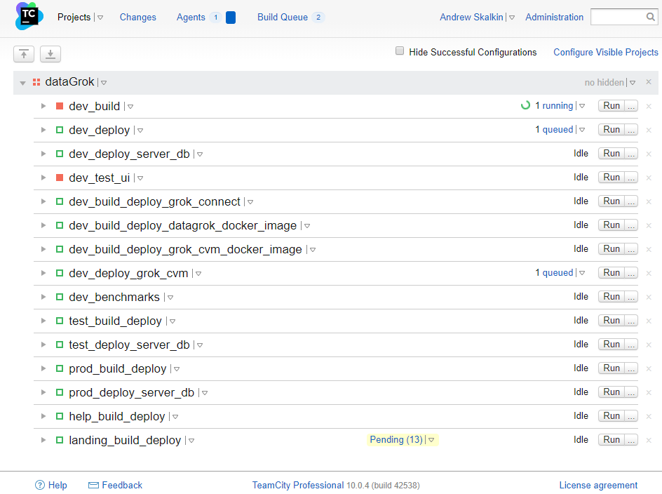
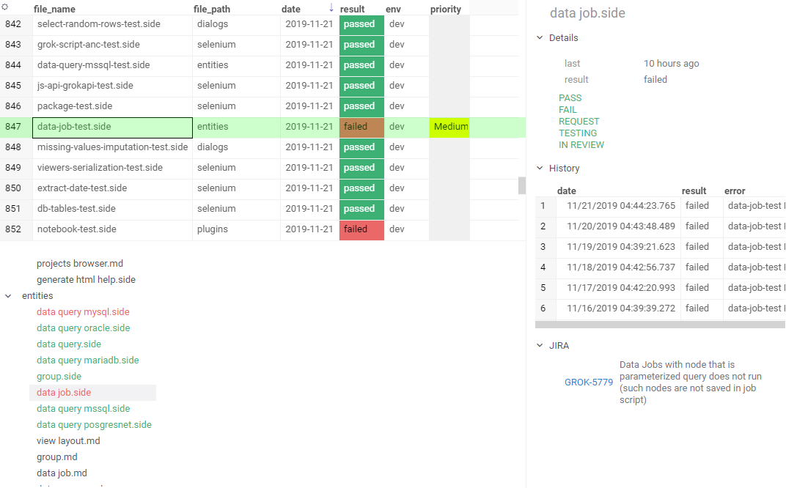

<!-- TITLE: Quality Assurance -->
<!-- SUBTITLE: -->

Datagrok is an incredibly powerful platform. In order to give users the best possible performance, 
we have created a number of unique, proprietary technologies such
as [in-memory columnar database](architecture.md#in-memory-database) and fast 
[visualizations](architecture.md#viewers). To provide the seamless end-to-end-experience, we
took ownership of 
[data access](../../home.md#access), 
[data governance](../../home.md#access),
[data exploration](../../home.md#explore),
[scientific computing](../../compute/scripting.md), 
[machine learning and artificial intelligence](../../home.md#explore), and
[collaboration](../../home.md#share). To make sure our enterprise customers can work with their 
data in a secure and efficient manner, we have built features like 
[authentication](../../govern/authentication.md), 
[audit](../../govern/audit.md), and 
[role management system](../../govern/authentication.md). The list goes on and on.
 
This sort of power comes at the cost of greatly increasing platform's complexity. 
While the core components developed by us are as small and lean as possible, as the number of the external 
systems we integrate with grows the dependencies and interactions become increasingly complex.
To address the issue, we have built our development practices around the idea of proactive
identification of defects. 

Here are some of the main components of our development infrastructure:   

## Continuous Integration System

Whenever a new code is checked in to our source code repository, a number of tasks 
get executed automatically:

1. Compilation
2. [Unit tests](#unit-tests)
3. [Integration tests](#integration-tests)
4. [UI Tests](#ui-tests)
5. [Performance benchmarks](#performance-benchmarks) 
6. [Stress testing](#stress-testing)
7. Deploying the server on dev environment
8. Packaging the platform in Docker containers 

We use TeamCity for continuous integration. This is how our control panel looks like:
 

## Unit tests

Our core libraries contain more than 2,000 [unit tests](https://en.wikipedia.org/wiki/Unit_testing) 
that serve two main purposes. First of all, they are produced, and get used in the process of the
[test-driven development](https://en.wikipedia.org/wiki/Test-driven_development). Secondly, they
get executed automatically as part of the continuous integration process, thus helping us
identify regression bugs.

Results of the UI tests are kept in the [test tracking system](#test-tracking-system). 
 
## Integration tests 

Integration tests are very similar to unit tests. While unit tests tend to address isolated modules,
integration tests cover interactions between different modules. Typically, they are a lot heavier
and much slower, so they are not used as frequently by developers.

Results of the integration tests are kept in the [test tracking system](#test-tracking-system).

## UI tests

For automated testing of the platform, we use Selenium, which works by emulating user 
input, and then checking for the expected result. 
We have over 100 complex UI tests, and the number is growing quickly. Each one is associated 
with a separate story, which is a plain text file describing the objective of the story
(i.e., "user queries a database"), actions (i.e., "user opens the data connection toolbox, ..."),
and the expected outcome (i.e. "results of the query are opened in the workspace"). 

Stories can be produced by external users, in which case our QA engineer translates them
to a script executable by Selenium. 

Overall, these tests cover a significant part of the platform's functionality, and there
is a good chance that a bug will be caught by that system.   

Results of the UI tests are kept in the [test tracking system](#test-tracking-system).

## Structured manual tests

Certain UI tests are so complex that it's impractical to develop and maintain corresponding scripts.
In such cases, we still write the story for it just like in [unit tests](#unit-tests). 

Structured unit tests are executed by our QA engineer, and results are reported to the
[test tracking system](#test-tracking-system).

## Unstructured manual tests

In addition to the testing outlined above, each release is manually tested by our QA engineer. 
The amount of testing depends on the magnitude of the release.  

## Test tracking system

In order to keep track of test execution results, we have built a special application 
on top of the Datagrok platform. Not only it lets us visualize the current state of the
application, but also it lets the QA engineer to efficiently work with stories by having the
ability to quickly read it, execute, and report the completion status. Moreover, it
lets us quickly navigate to the corresponding JIRA issues (integration with JIRA was
done using Datagrok's OpenAPI capabilities).

 

## Performance benchmarks

We consider performance an important feature of Datagrok, so we keep track of it. We run performance
benchmarks as part of the build, and keep track of the results to make sure the platform
only gets better with time.

## Stress testing

To make sure the platform is stable under heavy load (either many users working simultaneously, or
executing CPU-intensive computations), we perform automated 
[stress testing](https://en.wikipedia.org/wiki/Stress_testing)
regularly. The real workflow is emulated by spawning many virtual machines that have Selenium installed on them,
and executing selected [UI tests](#ui-tests) on them. There are two different passes. 

In the first pass, a normal, yet intensive, users activity is emulated by running tests in random order.

In the second pass, each of the selected tests is executed on all machines at the same time. This helps
us identify steps responsible for the performance degradation.

For more details on different environments, tests, and interpretation of results please
see [stress testing results](stress-testing-results.md). 

See also:

* [Architecture](architecture.md)