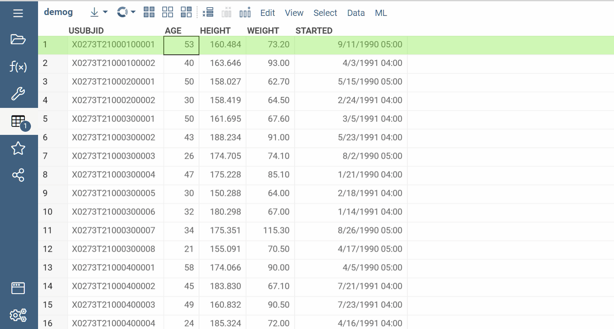

<!-- TITLE: Develop custom cell renderers -->

# Cell renderers

Datagrok provides an opportunity to use custom visualization for cells in data
[grid/table](../../visualize/viewers/grid.md). This could be done by defining a function annotated with special
comments. It should take no args, return an instance of class derived from DG.GridCellRenderer, and have at least
two tags: `cellRenderer` and `cellRenderer-<type>` (specify the cell type here). This is it!

The following example defines a cell renderer for summary column visualized as bar chart. This is real code from the
["PowerGrid" public package](https://github.com/datagrok-ai/public/blob/master/packages/PowerGrid/src/package.ts).
Be careful, there should be no spaces between the comment starting slash characters and the attribute name.

```typescript
//name: piechartCellRender
//tags: cellRenderer
//meta.cellType: piechart
//meta.virtual: true
//output: grid_cell_renderer result
export function piechartCellRenderer() {
  return new PieChartCellRenderer();
}
```

Renderer class derived from DG.GridCellRender must implement `name` and `cellType` properties, the main drawing
method `render`, and optional `renderSettings` methods allowing to build UI HTML Element for renderer settings.
An example is
available ["PowerGrid" public package](https://github.com/datagrok-ai/public/blob/master/packages/PowerGrid/src/sparklines/piechart.ts)
.

Once a package containing that function is published, the platform will automatically create the corresponding
renderer when user creates a summary column of specified type. Here is how it looks:



See also:

* [Customize a grid](./customize-grid.md)
* [JavaScript development](../develop.md)
