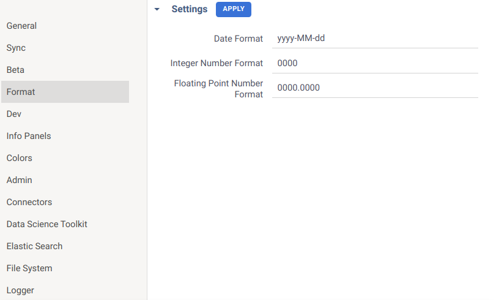

<!-- TITLE: Customize a Grid -->

# Grid Customization

Whenever users open a spreadsheet on the platform, they see it presented in a [grid](../../visualize/viewers/grid.md). This view can be altered in many ways, both from the user interface and programmatically. The aspects subject to change include:

* [formatting](#formatting) numbers and dates
* [ordering](#ordering) rows and columns
* controlling the [visibility](#column-visibility) of columns
* changing cell [size](#resizing)
* encoding categories with [colors](#color-coding) and many more

## Formatting

The Datagrok platform automatically sets the most appropriate format for numbers and dates in grid columns of a particular dataset. However, the way such columns look may be changed. The global formatting settings allow users to specify their default formats:



In addition to that, users may change the format directly in [column properties](../../visualize/viewers/grid.md#formatting) of an open table. This is done by defining the value of `format` tag. The syntax and standard formats are described in this [article](../../discover/tags.md#format) and given for reference in the respective [code snippet](https://public.datagrok.ai/js/samples/grid/data-format). Here is a brief example to illustrate how the representation of data can be changed:

```javascript
let view = grok.shell.addTableView(grok.data.demo.demog());

view.grid.col('height').format = 'scientific';
view.grid.col('weight').format = '#.0000';
view.grid.col('started').format = 'dd.MM.yyyy';
```

If a format is specified on a column level, it takes precedence over global settings. Another thing to keep in mind is that the tag applies only to numeric and datetime columns. Columns of other data types will ignore the `format` tag. As the actual values remain unchanged, sorting and filtering produce the same result regardless of selected data representation.

## Ordering

The order of rows and columns is easy to adjust. Let's have a look at columns first:

```javascript
let view = grok.shell.addTableView(grok.data.demo.demog());
view.grid.columns.setOrder(['age', 'sex', 'race']);
```

The column names are not case-sensitive. If a dataset consists of more columns than specified in the `setOrder` method, the unmentioned columns will appear after the given ones (this is shown in the [example](https://public.datagrok.ai/js/samples/grid/order-columns)). A different logic applies when arranging rows:

```javascript
let view = grok.shell.addTableView(grok.data.demo.demog());
view.grid.setRowOrder([1, 56, 3, 6, 4]);
```

The `setRowOrder` method accepts an array of row indexes (starting at zero) and displays the corresponding rows exclusively. This allows you to control which rows should be shown in the grid (check out the [example](https://public.datagrok.ai/js/samples/grid/order-rows)). On the other hand, if you want to keep all the rows and just sort them by a comparer function, you should use another method: 

```javascript
let data = grok.data.demo.demog();
let view = grok.shell.addTableView(data);

let height = data.col('height');
let weight = data.col('weight');
let bmi = (i) => height.get(i) / weight.get(i);

view.grid.sortIndexes((i, j) => bmi(i) - bmi(j));
```

The `sortIndexes` method sorts in ascending order, run this [code snippet](https://public.datagrok.ai/js/samples/grid/order-rows-by-comparer) to view the results. You can also sort rows by values of a particular column like this:

```javascript
view.grid.sort(['age']);
```

The default sort order is ascending. Provide the second argument to specify the direction: `true` stands for ascending and `false` for descending order.

## Column Visibility

It is possible to hide parts of data in a grid without actually removing them (see an [example](https://public.datagrok.ai/js/samples/grid/hide-columns)). To achieve this, either explicitly specify the columns you intend to show:

```javascript
let data = grok.data.demo.demog();
let view = grok.shell.addTableView(data);
view.grid.columns.setVisible(['age', 'sex', 'race']);
```

or hide the particular columns by adding `~` prefix to their names before creating a table view:

```javascript
let data = grok.data.demo.demog();
data.columns.byName('age').name = '~age';
let view = grok.shell.addTableView(data);
```

The approach largely depends on which columns are easier to list, but not only. Thus, to make the prefixed column visible again, it is not enough to invoke `setVisible(['~columnName'])`, you have to invert the previous change first. Besides, such renaming affects all table views derived from the data.

## Resizing

To change the size of a column in a grid, you need to set the `width` attribute of the column or row header:

```javascript
let data = grok.data.demo.demog();
let view = grok.shell.addTableView(data);

view.grid.columns.byName('age').width = 200;
view.grid.columns.byIndex(4).width = 300;
view.grid.columns.rowHeader.width = 100;
```

The row header counts as the first grid column, so calling `view.grid.columns.rowHeader` returns the same result as `view.grid.columns.byIndex(0)`. You can test this by running the above [example](https://public.datagrok.ai/js/samples/grid/resize-columns) on the platform.


## Color-Coding

A grid can encode column categories with color. For instance, assigning custom category colors looks as follows:

```javascript
let view = grok.shell.addTableView(grok.data.demo.demog());

view.grid.col('sex').categoryColors = {
  'M': 0xFF0000FF,
  'F': 0xFF800080
};
```

This [example](https://public.datagrok.ai/js/samples/grid/category-colors) is also available on the platform. If the object contains less categories than given in the corresponding column, the cells belonging to the unmentioned categories will be filled with default colors. This might help in cases when you want to enable color-coding with default colors, to do that, simply leave the object empty.

See also:
  * [Grid](../../visualize/viewers/grid.md)
  * [Table View](../../overview/table-view.md)
  * [JavaScript API: Grid](https://datagrok.ai/js-api/Grid)
