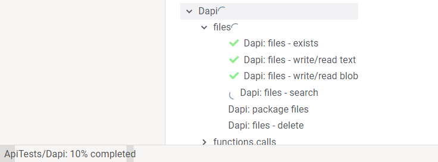

<!-- TITLE: Test packages -->

# Package testing

Testing is an essential part of development process. You should ensure that your product works properly at each stage of it's lifecycle. For instance, when developing a new version of a package you should perform regression testing and confirm that new changes haven't affected previous functionality. 
Each package should include a bunch of unit tests responsible for either UI or logic underneath. And Datagrok provides various capabilities and tools to conveniently run those tests any time during development. 

## Local testing

To test packages locally before publishing you can use the Jest framework.

1) set environment variables:
    * HOST - for host to publish and test package, for example 'localhost'
    * TARGET_PACKAGE - `friendlyName` for the package from `package.json`
2) [Run Datagrok instance locally](../admin/docker-compose.md)
3) [Configure grok tool](set-up-environment.md#configuration) with localhost credentials.
4) [Publish the package to the HOST](publish-packages.md#private-packages), which was set on the first step.

   ```shell
   grok publish <HOST>
   ```

5) Run tests for the package

   ```shell
   npm test
   ```

6) The results are available in the command-line output or the `test-report.html` file.

## Tests after a change in a public package

It is always a good practice to test the changes before publishing the package.

All public packages in the [repository](../../collaborate/public-repository.md) are tested using GitHub Actions on every
commit. For every changed package GitHub creates a new separate instance of Datagrok from the latest Datagrok docker
image. Then, it publishes a new version of the package to this instance. And then, the tests are executed on it.

The results are available in the actions artifacts: `test-<PACKAGE NAME>-<DOCKER IMAGE SHA>-<COMMIT SHA>.html`

### Trigger GitHub Actions manually

If an error occurred for the action triggered by the commit, it is possible to trigger the action manually.

1) Use [Packages workflow](https://github.com/datagrok-ai/public/actions/workflows/packages.yml)
2) Press `run workflow` and set packages list to test separated with spaces, for example: `Demo Tutorials`. Choose the
   target branch. Then `Run workflow`. Note that publish to the NPM registry is executed for the master branch only.
3) Check that the GitHub Actions workflow finished successfully
4) The results are available in the actions artifacts: `test-<PACKAGE NAME>-<DOCKER IMAGE SHA>-<COMMIT SHA>.html`

The same steps can be applied
for [Libraries workflow](https://github.com/datagrok-ai/public/actions/workflows/libraries.yaml)
, [datagrok-tools package](https://github.com/datagrok-ai/public/actions/workflows/tools.yml)
and [datagrok-api package](https://github.com/datagrok-ai/public/actions/workflows/js-api.yml)

## Test manager

'Test manager' is a tool within the Datagrok platform that provides a convenient interface to select and run package
unit tests with further results exploration. 'Test manager' itself is a part of the DevTools package.

To start 'Test manager' go to top menu Tools -> Dev -> Test manager


After starting the tool you will see a list of all packages which contain unit tests. Inside each package, the tests
are divided by category. Categories support multiple nesting (in this case subcategories should be divided by `:`). 
You can select required package/category/test by clicking on it. Also you can change selection by using `up` and `down` key buttons.


### Running tests

There are multiple ways you can run tests:

- by right clicking on package, category or test. Context menu with `Run` button will appear
- by selecting package, category or test and pushing `Enter`
- by selecting package, category or test and pushing `Run` on a ribbon panel
- by selecting package, category or test and pushing `Run` on a property panel
- individual tests can be run by double click
- you can run all tests at once using `Run all` button on the ribbon
- package, category or test can be run by putting the corresponding url into address bar of the browser. The format is the following `your_server_name/apps/DevTools/TestManager/package_name/category_name/test_name`.
You will see the progress icon opposite to active test/category/package which will end up in result icon after completion. In case at least one test fails within category or package the fail icon will be shown.


Progress bar on the bottom of the page will show the percentage of completed tests.



### Reviewing results
You can get information about test results via tooltip or in the property panel for the selected test, category or package.
In case category/package contain multiple tests results are shown as a grid which can be added to workspace for further exploration.


