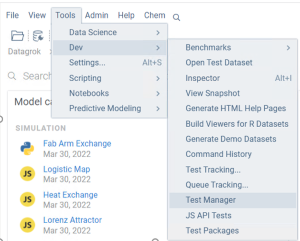

<!-- TITLE: Test packages -->

# Package testing

To make sure that a package works correctly it needs to be properly tested. Each package should include a bunch of unit
tests responsible for different aspects of the package such as UI or logic underneath. And developers should be able to
easily run tests at any time (while developing a package or performing regression testing).

## Local testing

To test packages locally before publishing you can use the Jest framework.

1) set environment variables:
    * HOST - for host to publish and test package, for example 'localhost'
    * TARGET_PACKAGE - `friendlyName` for the package from `package.json`

2) [Run Datagrok instance locally](../admin/docker-compose.md)

3) [Configure grok tool](set-up-environment.md#configuration) with localhost credentials.

4) [Publish the package to the HOST](publish-packages.md#private-packages), which was set on the first step.

```shell
grok publish <HOST>
```

3) Run tests for the package

```shell
npm test
```

4) The results are available in the command-line output or the `test-report.html` file.

## Tests after a change in a public package

It is always a good practice to test the changes before publishing the package.

All public packages in the [repository](../../collaborate/public-repository.md) are tested using GitHub Actions on every
commit. For every changed package GitHub creates a new separate instance of Datagrok from the latest Datagrok docker
image. Then, it publishes a new version of the package to this instance. And then, the tests are executed on it.

The results are available in the actions artifacts: `test-<PACKAGE NAME>-<DOCKER IMAGE SHA>-<COMMIT SHA>.html`

### Trigger GitHub Actions manually

If an error occurred during for commit action, it is possible to trigger the action manually.

1) Use [Packages workflow](https://github.com/datagrok-ai/public/actions/workflows/packages.yml)
2) Press `run workflow` and set packages list to test separated with spaces, for example: `Demo Tutorials`. Use
   the `master` branch. Then `Run workflow`
3) Check that the GitHub Actions workflow finished successfully
4) The results are available in the actions artifacts: `test-<PACKAGE NAME>-<DOCKER IMAGE SHA>-<COMMIT SHA>.html`

The same steps can be applied
for [Libraries workflow](https://github.com/datagrok-ai/public/actions/workflows/libraries.yaml)
, [datagrok-tools package](https://github.com/datagrok-ai/public/actions/workflows/tools.yml)
and [datagrok-api package](https://github.com/datagrok-ai/public/actions/workflows/js-api.yml)

## Test manager

'Test manager' is a tool within the Datagrok platform that provides a convenient interface to select and run package
unit tests with further results exploration. 'Test manager' itself is a part of the DevTools package.

To start 'Test manager' go to top menu Tools -> Dev -> Test manager



After starting the tool you will see a list of all package tests divided by package name. Inside each package, the tests
are divided by category. Using checkboxes you can choose which tests you want to run at a time. You can choose either
the whole package or required category or exact tests inside a category. After all required tests are selected click on
the `RUN` button at the top.


Failed tests are marked with a red cancel sign while passed tests are marked with a green tick mark.


You can get more detailed information on test results by clicking on a test/category/package name. Information will be
shown on a property panel.


