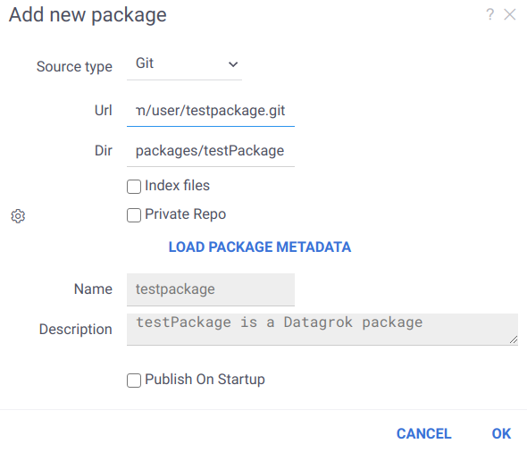

<!-- TITLE: Publishing -->
<!-- ORDER: 2 -->

# Publishing

After your package for Datagrok is ready, you might want to publish the package. This document describes various aspects 
of publishing packages to Datagrok.

## Table on contents

* [Version control](#version-control)
* [Deployment modes](#deployment-modes)

## Version control

When you publish a package, Datagrok creates a _published package_ entity, which is associated with the package and has 
additional metadata, such as the publication date.

Typically, the user can see only one version of a package. Datagrok administrators manage published packages and decide
which versions should be used. It's possible to roll back to an older version, or assign a particular package version to 
a particular group of users.

> **Important**: If the version of a package changes, Datagrok will create an independent instance of each package asset.

Multiple versions of a package can be deployed at one moment, and the administrator can switch between them. All users
will see is objects that belong to the current (latest) package version.

Datagrok creates a special _debug_ version for each package. If you deploy it, it becomes active for the current package 
until you delete it or change the developer key. With a debug version, the developer can can work on the package without
affecting the other package versions. The debug version will no longer exist after the developer releases their package.

## Deployment modes

You can use the following flags to specify who can access your package:

* **debug** (default), only you (the author) can see the package on Datagrok.
  To deploy your package in debug mode, run the command `grok publish --debug` (or simply `grok publish`).
* **release**, all Datagrok users who were granted access to this package can access it in Datagrok.
  To deploy your package in release mode, run the command `grok publish --release`.

To learn more about the commands and options, refer to the [Grok CLI] documentation.

## Publishing from a repository

To publish a package from your repository:

1. On the Datagrok public site, select the **Manage** icon > **Packages** > **Add new package**.
2. In the **Add new package dialog**, select **Git** as the source type, enter the URL to your repository on GitHub, 
   GitLab, or Bitbucket, and specify the package directory relative to its root.
3. Click **Load Package Metadata** to get the package name and description.
4. Select **Publish on Startup**, and then select **Ok**.



## Continuous integration

Package publication is compatible with automation tools. You can pass your server URL and developer key to the `grok`
command without additional configuring:

```shell
grok publish <url> -k <dev-key>
```

## Sharing a package

Just like other entities on the platform, packages are subject to [privileges](../../govern/security.md#privileges). You
can specify the viewing or editing rights for a developer and, optionally, notify them.

It's possible to manage the access directly from the package. For that, specify the eligible user groups in `package.json`:

```json
{
  "canEdit": [
    "Developers"
  ],
  "canView": [
    "All users"
  ]
}
```

## What's next?

* [Debugging](./_debugging.md)
