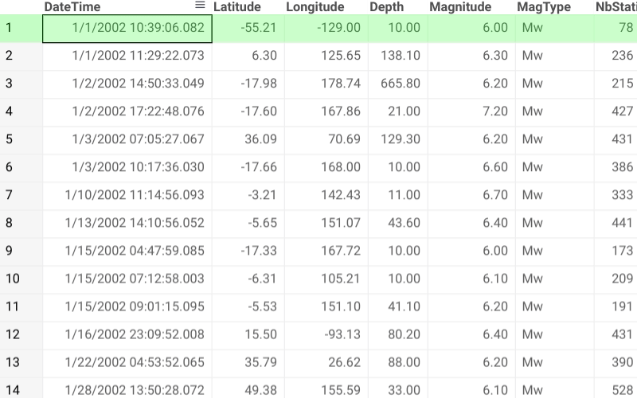
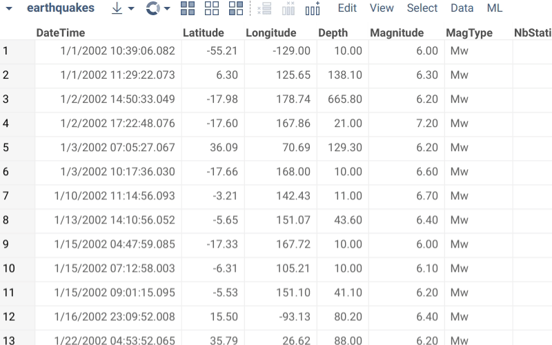

<!-- TITLE: Semantic Types -->
<!-- SUBTITLE: -->

# Data Types vs Semantic Types

Unlike Excel, table columns in Datagrok are strongly-typed, meaning all cells are of 
one of the pre-defined data types (`string`, `int`, `bigint`, `qnum`, `double`, `datetime`, `bool`).
In addition to that, a column might also have semantic type associated with it. Semantic type identifies
the meaning of the data. For instance, a column could be of the data type "string", but
the semantic type would be "country".

Semantic types are used in several ways:
* **Rendering.** It is possible to define a custom renderer defined for the semantic type.
  For instance, in the #{x.Demo:Smiles} project strings with the semantic type "molecule" get rendered as 
  chemical structures.
* **Viewers.** Some viewers, such as Map, use semantic type to determine whether a viewer
  can be visualized against specific datasets, as well as for the initial choice of columns
  to visualize.
* **Functions.** Function parameters could be annotated with the semantic type. This is 
  used for automatic suggestions of applicable functions.
* **Predictive models.** Just like functions, semantic type annotations are used to determine
  whether or not a model is applicable to the dataset.  

A column can have only one semantic type. It is stored in the [column tags](tags.md#semantic-type) and can be either detected automatically by semantic type detectors or set manually.
               
## Manually Setting Semantic Types

Open column properties (click on a column and press F2, or right-click and select Properties), 
see 'Semantics' field.

## Automatic Semantic Type Detection

Out of the box, the following semantic types are automatically detected based on the content:

* Molecule
* IP Address
* Area Code
* Zip Code
* Phone Number
* Email
* Latitude
* Longitude
* Country name (notations: common, cca2, cca3, cioc)
* US State (notations: common, abbreviated)
* US County
* US City
* Stock ticker

## Custom Semantic Types

Datagrok has been designed to be as extensible as possible, so naturally it is possible
to define your own custom semantic types, along with the type auto-detection functions,
renderers, comparers, and so on. To do that, check out [this article](../develop/how-to/semantic-type-detector.md).

See also:
  * [Metadata](metadata.md)
  * [JavaScript Development](../develop/develop.md)
  * [How to Define Semantic Type Detectors](../develop/how-to/semantic-type-detector.md)
