<!-- TITLE: Macromolecules -->

# Datagrok for Macromolecules

## Datagrok, the Swiss Army knife for data gets a new blade for macromolecules

Datagrok is a platform of choice for analyzing assay data in a few big pharma companies and in several smaller biotech
companies. Datagrok natively supports cheminformatics and bioinformatics, with an extensive toolset supporting SAR
analisys for small molecules and antibodies.

With Datagrok for Macromolecules, we are expanding our capabilities to **polymer design** and **sequence-activity
relationship** analysis. Our molecular toolkit used across our applications allows to work efficiently with
macromolecules both on the macro (sequence) level and going all the way down to atoms if necessary.

### Align peptide and nucleotide sequences containing non-natural amino acids or modified nucleotides

Datagrok provides well-known algorithms for pairwise alignment as part of the Bio package: Smith-Waterman and
Needleman-Wunsch. For multiple-sequence alignment, Datagrok uses the “kalign” that relies on Wu-Manber string-matching
algorithm. It is an open-source tool under GNU GPL, so it can be modified to work with custom substitution matrices for
sequences of the custom alphabet. For maximum performance and scalability hese algorithms can run in user’s browser or
server-side.

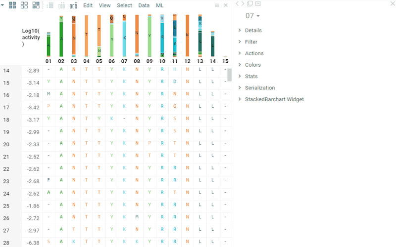

We are utilizing "PepSea" tool for analyzing peptide and nucleotide sequences containing non-natural amino acids or
modified nucleotides. It allows for alignment of multiple peptide sequences in HELM notation, with lengths up to 256
non-natural amino acids. "PepSea" uses a substitution matrix calculated with Rapid Overlay of Chemical Structures
Similarities Across ChEMBL 28 HELM Monomers (779). PepSea can be used as an in-house web service

### Utilizing HELM for description, management and visualization of biopolymers, including those with non-natural amino acids or modified nucleotides

Datagrok supports ingesting data in multiple file formats (such as fasta or csv) and multiple notations for natural and
modified molecules, aligned and non-aligned forms, nucleotide and amino acid sequences. We support all widely used
notation systems for molecular representations, and process them in a unified way. The sequences are automatically
detected and classified, while preserving their initial notation. HELM perfectly fits the requirements for this kind of
unification. If a dataframe contains any sequence data, it will be recognized and annotated appropriately.

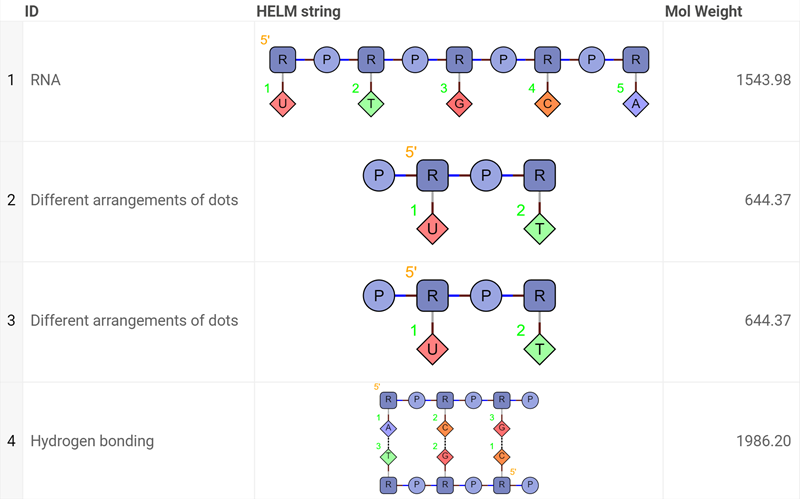

Automatic conversion to HELM from other notations will occur as necessary. The user can get a HELM plot for each
sequence, with all the monomers included in a graph, even if the original notation was not HELM. Datagrok HELM package
already allows to ingest, auto-detect, visualize, and edit HELM. 

Support monomer libraries in the enterprise context (privileges, sharing).

### Visualizing Assay Data and Dose-Response Curves

The built-in spreadsheet is designed for interactive analysis of vast amounts of scientific data. The system could be
extended with plugins that provide support for cheminformatics/bioinformatics, or for custom cell renderers for
molecules, sequences, or dose-response curves.

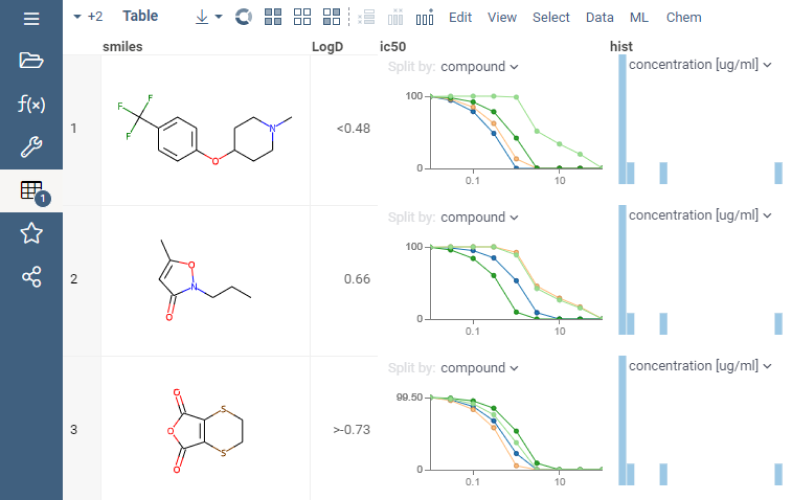

### Visualize Sequence Alignments

When a file containing sequences is imported, Datagrok splits the aligned data into an alignment table by MSA
positions (see the illustration below) and performs composition analysis in a barchart on the top of this table. It
visualizes multiple sequence alignments with long monomer identifiers.

The composition barchart is interactive, the corresponding rows could be selected by clicking on the segment. The rows
are also highlighted in other open visualizations (such as scatter plots) when you hover over the bar - this allows
quick dat exploration.

For identifiers that do not fit in a cell, an ellipsis is shown.

### Atomic-Level Structures from Sequences

We have developed an algorithm to generate the atomic structure of the sequences based on a specific monomer library or
from natural monomers. Datagrok has two options of reproducing the structure. First, is a direct generation from HELM
notation using HelmWebEditor functionality. In this case an unordered graph representation will be returned. Second, for
linear sequences, the linear form (see the illustration below) of molecules is reproduced. This is useful for better
visual inspection of sequence and duplex comparison.

We can reproduce this approach for any given case of HELM notation in order to get a visually appropriate form of
monomers in cycles etc. Structure at atomic level could be saved in available notations – smiles, mol V2000, mol V3000.

You can easily run this feature for any sequence data using Bio package.
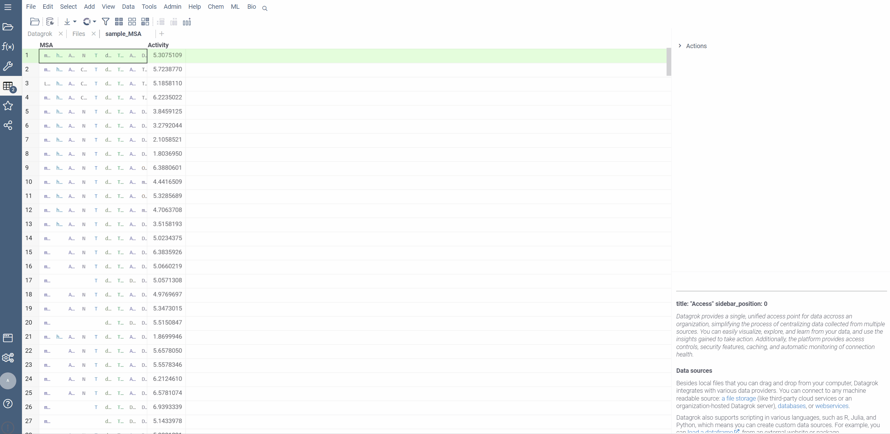

### Displaying and analyzing polymer structures and SAR data at the monomer and atomic level

Since atomic-level structure is available for each monomer and macromolecule, all the cheminformatics features of
Datagrok can be used. Namely: similarity search, substructure filtering, structure curation for structural data,
activity cliffs analysis for pairs of structures and SAR data.

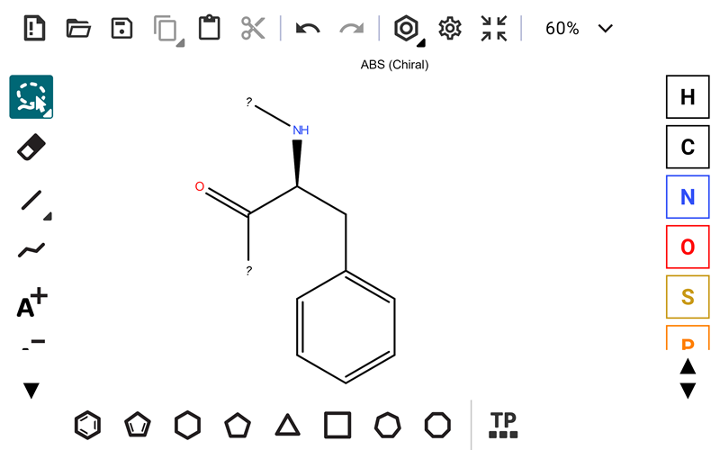

For analyzing polymer structures at the monomer level, Datagrok provides a set of tools and approaches (such as WebLogo
plots, interactive sequence-aware spreadsheet, etc), as well as applications that are built for specific modality, such
as [Peptides](peptides.md).

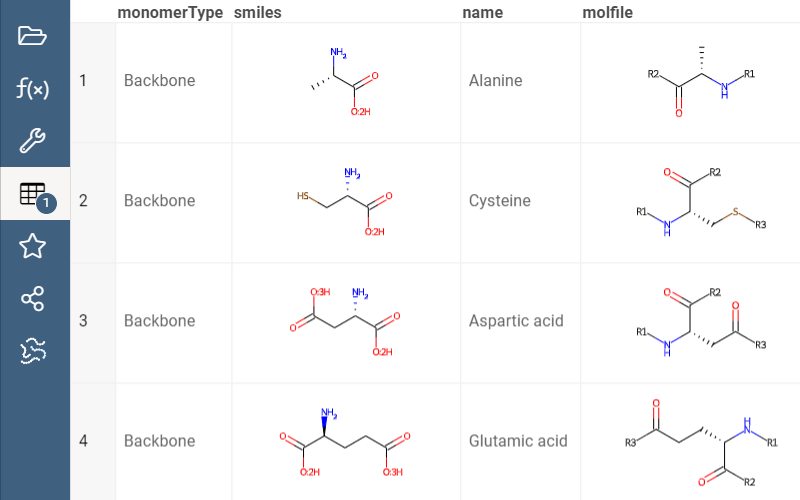

### Multiple Sequence Alignment Analysis

Sequences of a particular column can be analyzed with MSA algorithm (kalign tool). Aligned sequences can be
inspected for base composition at the position of MSA result.

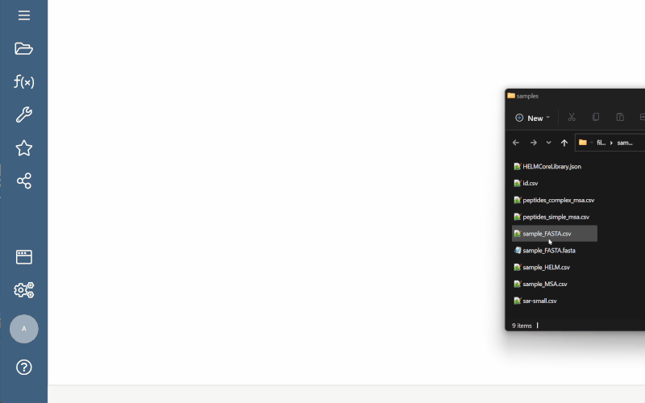

### Sequence Analysis and Analytics

MSA results can be visualized with the Logo Plot. It dynamically reflects the sequence sets filtering and allows the
user to select a subsequence by choosing the residue at a specified position. The tooltip displays the number of
sequences with a specific monomer at a particular position

Peptide Space tool visualizes the sequences as points in a 2D space. The sequences are distributed by the UMAP algorithm
with Levenstein distance. The plot is interactive and allows subsetting.

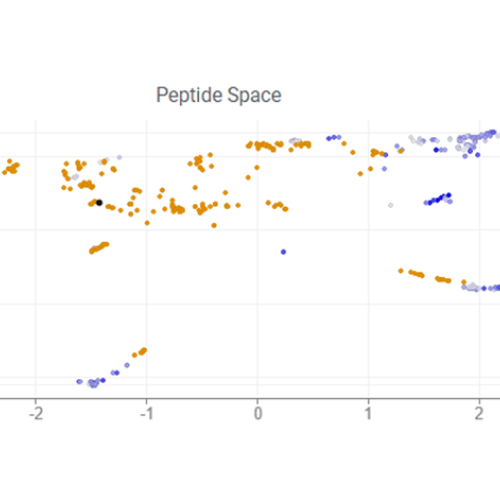

### Enabling quantitative sequence-based activity relationship functionality to enable design and optimization of polymer modalities

Out of the box, Datagrok provides a comprehensive [machine learning toolkit](../../learn/data-science.md) for
clustering, dimensionality reduction techniques, imputation, PCA/PLS, etc. Some of these tools could be directly applied
to the polymer modalities (for instance, by mapping monomers to features) and used for analyzing structure-property,
structure-activity, and sequence-activity relationships. Also, a number of tools have already been developed
specifically for polymer modalities.

One of such tools is the ["Peptides"](https://www.youtube.com/watch?v=HNSMSf2ZYsI&ab_channel=Datagrok) plugin. When a
user opens a dataset with sequences that resemble peptides, the platform recognizes it, renders the sequences in a
specific way in the spreadsheet, and suggests to launch an analysis of the dataset. Upon launching, the UI switches to a
fit-for purpose peptide analysis mode for efficient exploration of the peptide space, allowing the following:

- Interactively filter the dataset based on the monomer, position, or any other attribute
- Analyze differences in activity distribution for groups of peptides, including the calculation of statistical
  significance on-the-fly
- Analyze the peptide space (UMAP based on distance, color-coded by activity)
- Automatically identify most potent monomer/positions

We are developing tools that account for the steric and surface features of macromolecules, calculations to support the
knowledge on their properties, homology, toxicity.

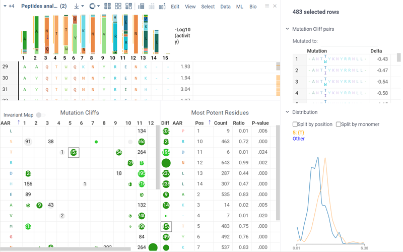

See [Peptides plugin](https://public.datagrok.ai/apps/Peptides) in action

### Integrate Predictive Models

In addition to the [built-in predictive modeling capabilities](../../learn/predictive-modeling.md) (including
cheminformatics-specific ones, such as chemprop), it is easy to connect to external predictive models that are deployed
as web services. Two big pharmaceutical companies have already done that.

The integration could be done in a several ways:
Automatic ingestion of the [OpenAPI/Swagger](../../access/open-api.md) service definition

Developing a wrapper [function](../../compute/compute.md) in JavaScript, Python, R, or Matlab

Once a model is converted as a function, there are multiple ways to expose it to users:
Develop a Datagrok application that would orchestrate everything (such as the “sketch-to-predict” interactive app)

Leverage Datagrok’s [data augmentation](../../discover/data-augmentation.md). For instance, in this case, a user will
see the predictions when he clicks on a cell containing the macromolecule (similarly to
how [predictions and information panels for small molecules](../../discover/data-augmentation.md#info-panels)

See also: [Scientific computing in Datagrok](https://github.com/datagrok-ai/public/blob/master/help/compute/compute.md)

### Connectivity

For data retrieval, Datagrok offers high-performance, manageable [connectors](../../access/data-connection.md) to all
popular relational databases. The built-in spreadsheet is designed
for [interactive analysis](../../visualize/viewers.md) of vast amounts of scientific data. The system could be extended
with plugins that provide support for cheminformatics/bioinformatics, or for custom cell renderers for molecules,
sequences, or dose-response curves.

See the [joint Datagrok/Novartis demo](https://vimeo.com/548606688/f2dd6e5c0a) for more details and a real-world use
case (the second part describes Novartis’ system built on top of Datagrok).

### Sequence space

Datagrok allows to visualize multidimensional sequence space using dimensionality reduction approach. There are several dimensionality reduction algorithms available such as widely spread UMAP or t-SNE. Algorithms reduce the dimensionality of initial vector space and draw points/projections closer to each other if they correspond to similar structures, and farther otherwise, so that the distance between two points on a projection is determined by the similarity of molecules. The tool for analyzing molecules collections is called 'Sequence space' and exists in Bio package.

You can open the tool from a top menu by selecting Bio -> Sequence space.

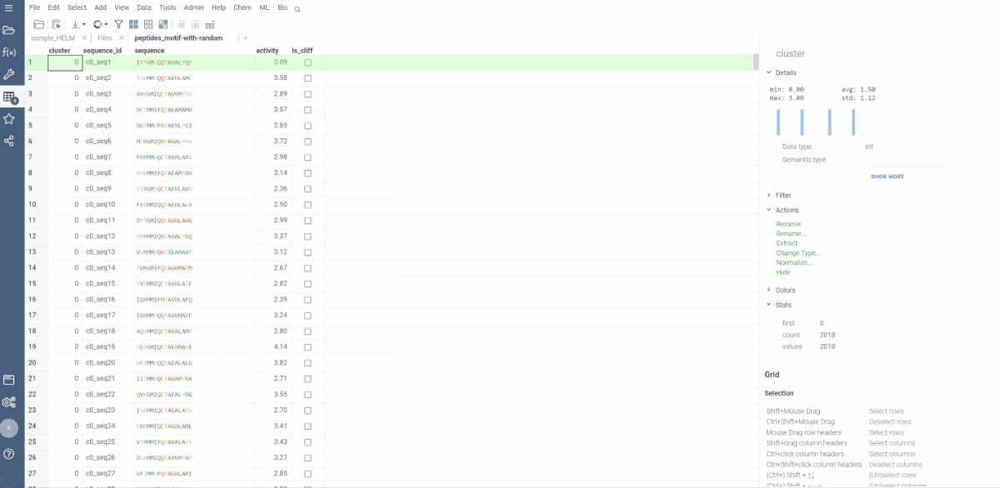

### Sequence activity cliffs
Activity cliffs is a tool which not only visualizes multidimensional sequence space in 2-dimensional scatter plot but also shows links between molecules which are similar in structure but differs in activity.
You can open the tool from a top menu by selecting Bio -> Sequence Activity Cliffs. Similarity cutoff and similarity metric are configurable.
As in Sequence space you can select from different dimensionality reduction algorithms.

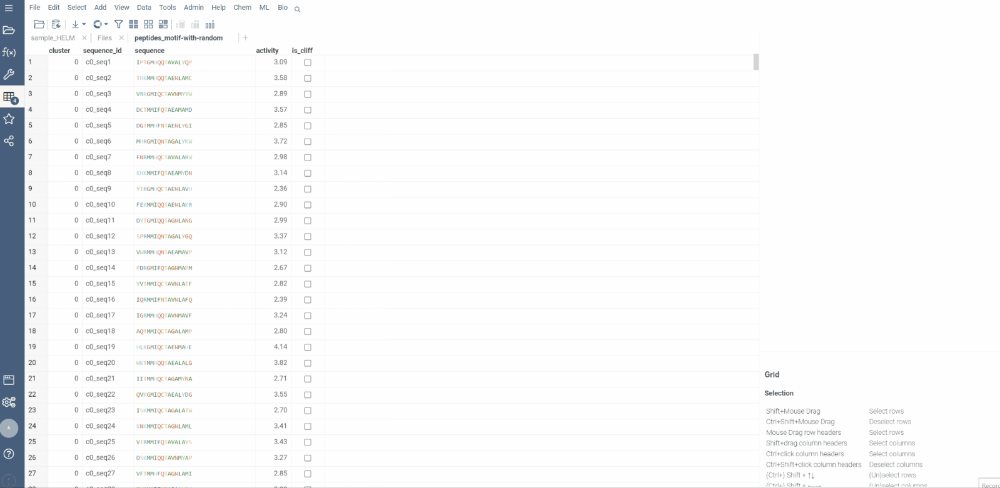

After scatter plot is generated in the right top corner of it you will see a link with number of activity cliffs identified. By clicking on this link you will open a dialog with the table of corresponding cliffs. You can easily zoom in to cliff of interest and analyze it on a scatter plot. By hovering over a line a tooltip will appear with a pair of selected structures with activities.

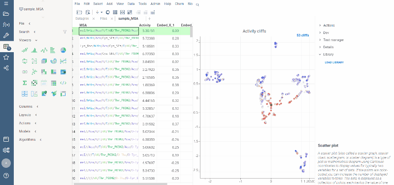

The line can also be selected with Ctrl click. Corresponding row will be marked as selected in cliffs table. And it works both ways. By selecting a row in table with Ctrl key the corresponding line will be selected on the scatter plot.

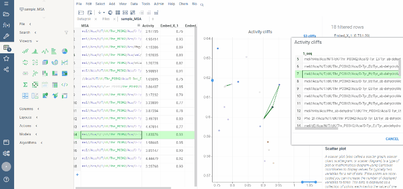

Point color corresponds to activity, point size and line opacity correspond to SALI parameter (similarity/activity difference relation).

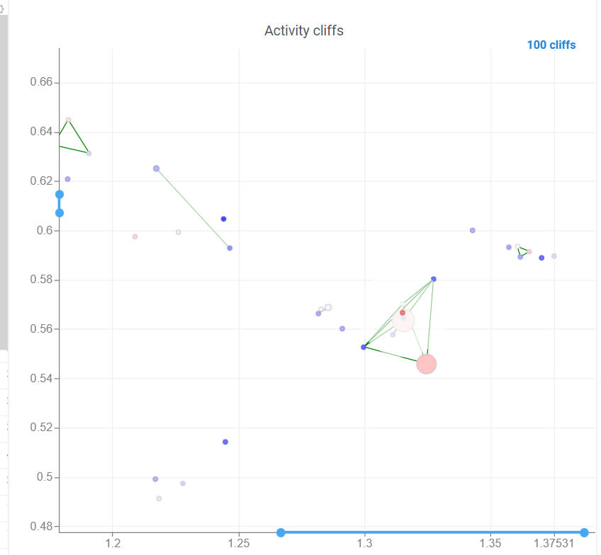

### Convert sequence notation

There are many formats used to store biological sequences such as traditional FASTA (one symbol per monomer) or
for more complex / modified monomers separators are used. Another approach is to write long monomer name to FASTA
with square brackets. So Datagrok offers the converter.

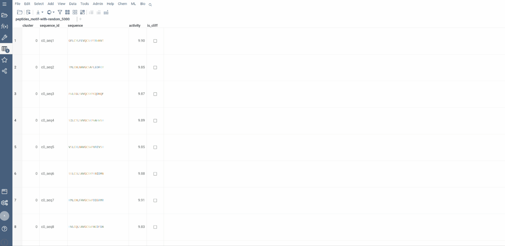
