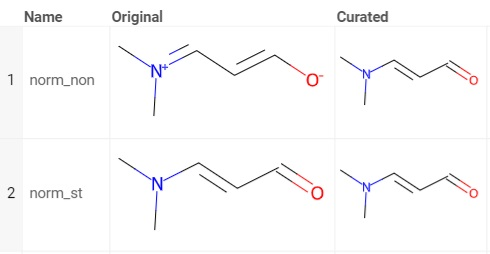
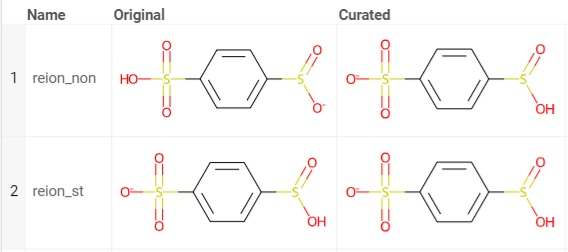
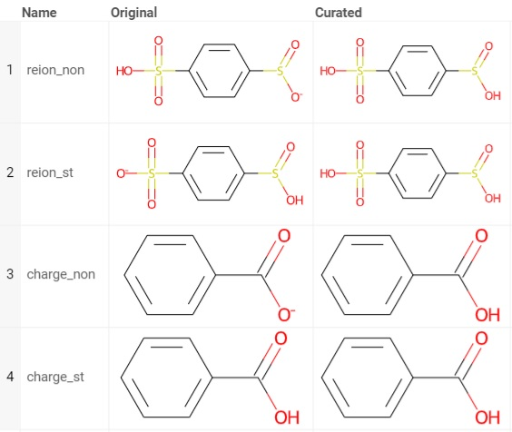
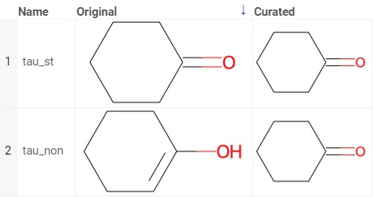
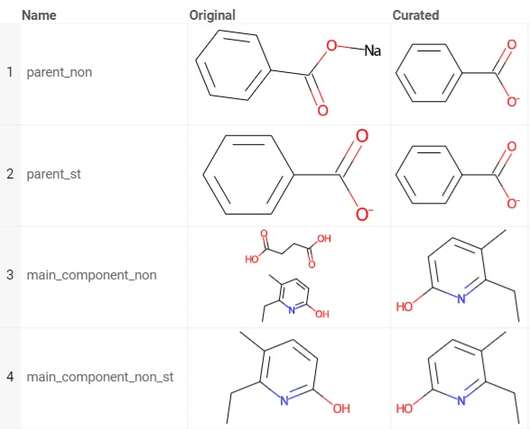

<!-- TITLE: Cheminformatics Chemical Structures Curation -->
<!-- SUBTITLE: -->

Curation tools could be used for a wide spectrum of purposes and propose different ways which one can use in a preferred combination.
 
When no options are chosen the curation tools will process sanitization procedures and will perform chemotypes standardization with no actual modification of input data. All possible options also include this procedure and execute a specific task. All given examples show that pairs of different graphs may correspond to a single structure if certain conditions are applied.
 

 
# Kekulization
 
Chemical structure graphs with aromatic systems have different representations. In the first case all bonds in aromatic systems are introduced as single and double bonds and in the other all aromatic bonds are introduced in a special way and thus to generate other type of descriptors. This option detects and unifies all aromatic bonds.
 
# Normalization
Normalization is used mostly for handling the zwitterions - ions with both positive and negative charges that could be neutralized by each other at certain pH values. Such molecules are electrically neutral and in physiological conditions, such atom charges are indeed neutralized. 
 

 
# Reionization
 
In some other cases structures are not electrically neutral but atom charges do not satisfy the lowest energy condition so reionization procedure is advisable. 
 

 
# Neutralization
 
In cases when biological properties of the compound are prior to all other properties, it is commonly practiced to proceed with neutralized structures so even charged molecules are transformed to their electrically neutral form. This procedure should be used with the assumption that base and salt forms have the same activities. It should be noted though that there are structures that could not be neutralized, such as structures with quaternary nitrogen with no hydrogen neighbors, they basically do not have base form and exist only as salts. 
 

 
# Tautomerization
 
One of the most surprising phenomenon are tautomers - compounds that exist in two or more structural forms at the same time in everyconverting state. To simplify the analysis of such structures tautomerization procedure has to be done. As a result, there will be only one most common form of the tautomer in the dataset. 
 

 
# Main fragment
 
Analysis of mixtures or salts is rarely used so one may prefer to proceed only with the main fragment. This procedure is widely used in combination with neutralization. 
 

 