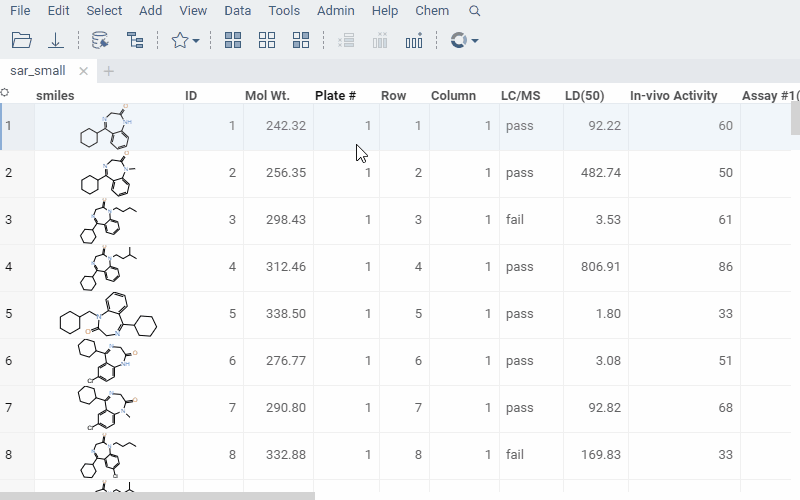

<!-- TITLE: R-Group Analysis -->
<!-- SUBTITLE: -->

# R-Group Analysis

R-Group Analysis is a common function in chemistry. Typically, it involves R-group decomposition, 
followed by the visual analysis of the obtained R-groups. Grok's chemically-aware 
[Trellis Plot](../../visualize/viewers/trellis-plot.md) is a natural fit for such an analysis. 

R-group decomposition is a special kind of substructure search that aims at finding a 
central structure (scaffold), and identify its ligands at certain attachment positions. 
The query molecule consists of the scaffold and ligand attachment points represented by R-groups.

`Chem | R-Group Analysis...` guides users through the steps of specifying the 
common core (scaffold) for the specified molecular column, executing R-group decomposition, and 
visually analyzing the results in the [Trellis Plot](../../visualize/viewers/trellis-plot.md).

### Specifying common core

There are two ways to specify a scaffold:
1. Draw it manually in the [sketcher](sketcher.md)
2. Click on 'MCS' to automatically identify Most Common Substructure 

### Visual analysis of R-group decomposition

Related functions:

* #{x.ChemFindMCS}
* #{x.ChemMurckoScaffolds}
* #{x.ChemGetRGroups}

See also:
  * [Cheminformatics](cheminformatics.md)
  * [Murcko Scaffolds](functions/murcko-scaffolds.md)
  * JS API: [R-Group](https://public.datagrok.ai/js/samples/domains/chem/r-group)
