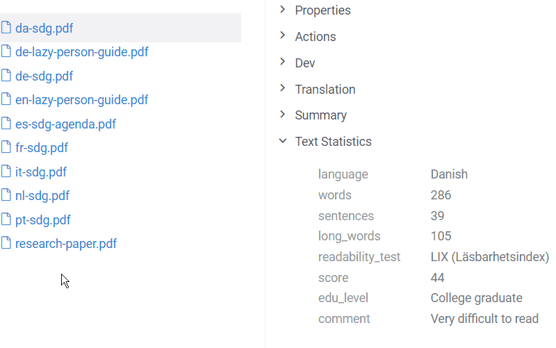

<!-- TITLE: Natural language processing -->
<!-- SUBTITLE: -->

# Natural language processing

The Datagrok platform has a plugin designed for natural language processing. This feature
can be applied to comfortably work with [files](../../access/file.md) with text content.
To try it out, import your text files according to the [instructions](../../access/importing-data.md)
or use the provided [demo files](https://public.datagrok.ai/files/demo.testjobs.files.demofiles/nlp).
The rest of the article is dedicated to the main applications of this domain integrated into the platform.

## Text extraction

It all starts with extracting text. This is a building block for other, more
complex tasks. Due to the high demand, it is essential to support as many
popular text file formats as possible. The platform comes with a built-in
[file browser](../../access/file-browser-and-file-shares.md) for easy file management.
The *NLP* package extends it by processing text from `pdf`, `doc`, `docx`, `odt`, and other text formats.

*In addition to the file preview, the plugin enables the 'Text Extractor' info panel*

## Language identification

Determining the language of a document is an important preprocessing step for
many language-related tasks. Automatic language detection may be part of
applications that perform machine translation or semantic analysis. Datagrok's
language identification is powered by Google's [Compact Language Detector v3 (CLD3)](https://github.com/google/cld3)
and supports over [100 languages](https://github.com/google/cld3#supported-languages).
As with text extraction, this functionality is used in the [Translation](#neural-machine-translation) info panel.

## Neural machine translation

The package creates a new info panel for text files. It uses [AWS Translate](https://aws.amazon.com/translate/) service,
which supports over [70 languages](https://docs.aws.amazon.com/translate/latest/dg/what-is.html#what-is-languages).

To translate a text, navigate to the file browser and select one of the demo files.
Alternatively, open your personal folder and drag-and-drop your file to the platform.
Now, whenever you click on the file, you will see a suggestion to translate it in the property panel on the right.

The language is identified automatically, but you always have a chance to change it manually.
The default target language is English, so be sure to choose another option if the original text is in English.

## Text statistics

Increasingly often texts are analyzed for readability. Readability scores take
into account various parameters: the average number of words per sentence or
syllables per word, percentage of long words, etc.

The `Text Statistics` info panel calculates two common formulas:

* [Flesch reading-ease](https://en.wikipedia.org/wiki/Flesch%E2%80%93Kincaid_readability_tests) test for English
* [LIX](https://en.wikipedia.org/wiki/Lix_(readability_test)) formula for other languages

## Videos

[User Meeting 9: Natural Language Processing](https://www.youtube.com/watch?v=GM3XixUFFUs&t=94s)

See also:

* [Natural language processing](https://en.wikipedia.org/wiki/Natural_language_processing)
* [Scripting](../../compute/scripting.md)
* [Info panels](../../discover/info-panels.md)
