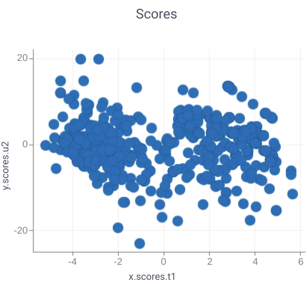
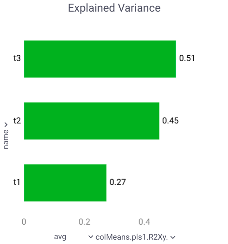
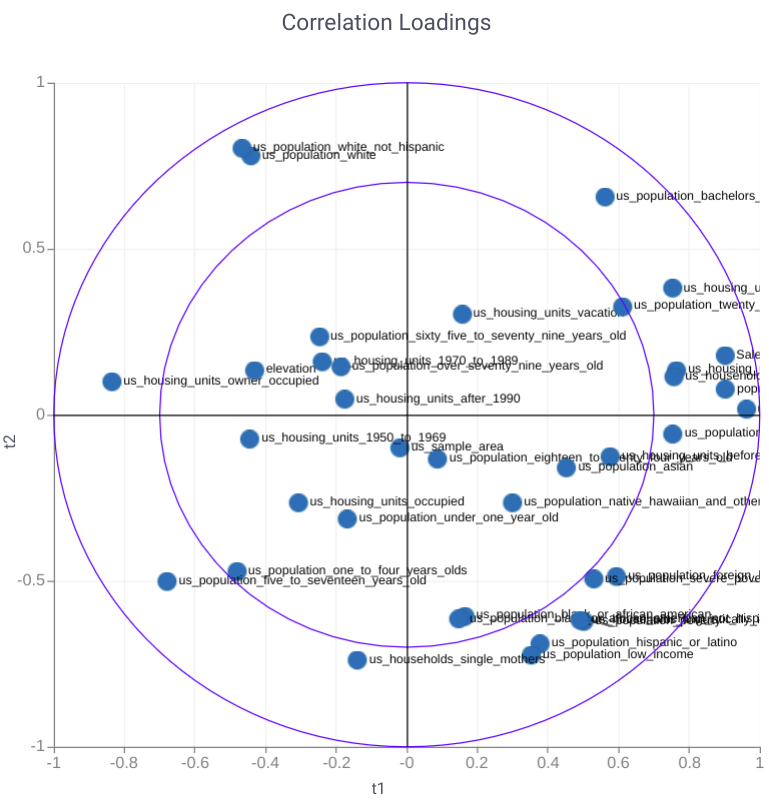
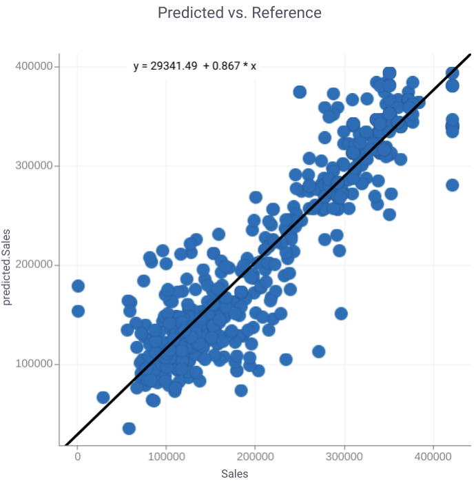
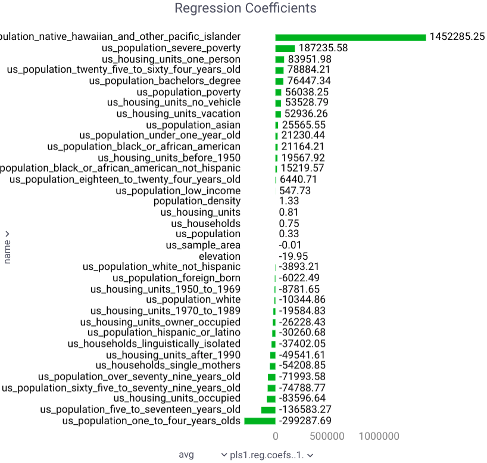

<!-- TITLE: Multivariate analysis based on partial least squares (PLS) -->
<!-- SUBTITLE: -->

# Multivariate analysis based on partial least squares (pls)

Multivariate analysis (MVA) is based on the statistical principle of multivariate statistics, 
which involves observation and analysis of more than one statistical outcome variable at a time.  
  
Partial least squares regression (PLS regression) is a statistical method that bears some 
relation to principal components regression; instead of finding hyperplanes of maximum variance 
between the response and independent variables, it finds a linear regression model by projecting 
the predicted variables and the observable variables to a new space. Because both the X and Y 
data are projected to new spaces, the PLS family of methods are known as bilinear factor models.

## Regress and analyse

  * Open a table
  * Run from the top menu: `ML | Multivariate Analysis (PLS)...`
  * Select a table that contains features
  * Select an outcome column
  * Select feature columns
  * Select the number of extracted PLS components
  * Set checkbox to plot `Scores`, if required
  * Set checkbox to plot `Explained Variance`, if required
  * Set checkbox to plot `Correlation Loadings`, if required
  * Set checkbox to plot `Predicted vs. Reference`, if required
  * Set checkbox to plot `Regression Coefficients`, if required
  * Run PLS

## Outputs

### [Scores](plots/scores.md)

Scatter plot of PLS components (T-components) vs. scores of the response variable (U-components).

 

### [Explained variance](plots/explained-variance.md)

Bar chart with explained variance of variables by PLS-components, cumulative sum by each of components.

 

### [Correlation loadings](plots/correlation-loadings.md)

Scatter plot of correlations between the variables and the PLS components.

The loadings plot shows correlations between variables. Comparing the correlation loadings to the 
scores shows how the variables relate to the observations.

 

### [Predicted vs. reference](plots/predicted-vs-reference.md)

Scatter plot of PLS components (T-components) vs. scores of the response variable (U-components).

The scores plot shows correlations between observations (how observations related to each other, 
occurrence groups or trends).

 

### [Regression coefficients](plots/regression-coefficients.md)

Bar chart with regression coefficients (used with the original data scale).  
  
 

See also:
  * [Multivariate analysis](https://en.wikipedia.org/wiki/Multivariate_analysis)
  * [Partial Least Squares (PLS)](https://en.wikipedia.org/wiki/Partial_least_squares_regression)
