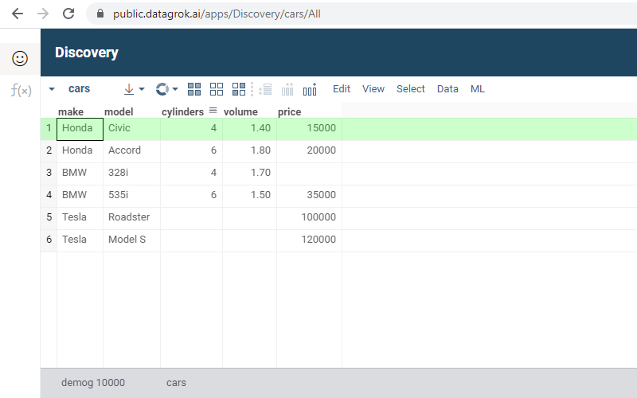
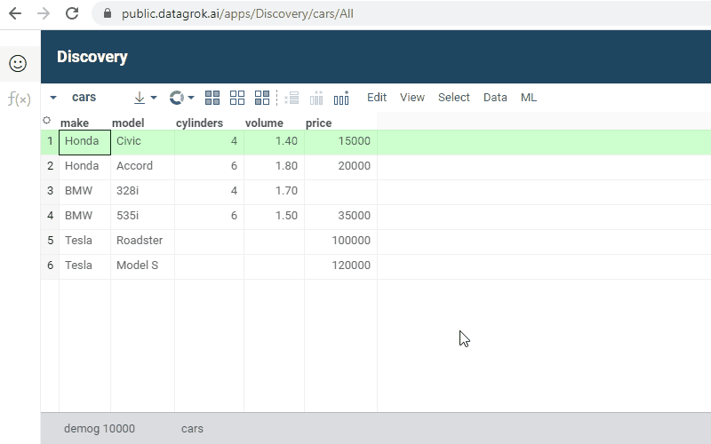

<!-- TITLE: Routing -->
<!-- SUBTITLE: -->

# Routing

In this article, we will consider the places in Datagrok, in which the platform, after refreshing the browser page, retains its state before refresh.


It can also be useful for quickly sharing something by simply copying the URL and sending it to another person to whom you want to show a particular view, project, application, etc.


Also, Datagrok supports some actions that can be performed after going to specific URL. (for example, executing a query with the given parameters). We will consider all this below.

## Entity Browsers

Entity browsers are special Platform views that display a set of available certain entities to the user. 

Each such browser is available for opening by ULR.

Platform has browsers for the following entities:

| Entity Browser                                 | URL                                     |
|------------------------------------------------|-----------------------------------------|
| [Projects](../overview/project.md)             | https://public.datagrok.ai/projects     |
| [Files](../access/file-shares.md)              | https://public.datagrok.ai/files        |
| [Queries](../access/data-query.md)             | https://public.datagrok.ai/queries      |
| [Scripts](../develop/scripting.md)             | https://public.datagrok.ai/scripts      |
| [Functions](../overview/functions/function.md) | https://public.datagrok.ai/functions    |
| [Applications](../develop/develop.md)          | https://public.datagrok.ai/apps         |
| [Models](../learn/predictive-modeling.md)      | https://public.datagrok.ai/models       |
| [Notebooks](../develop/jupyter-notebook.md)    | https://public.datagrok.ai/notebooks    |
| [Users](../govern/user.md)                     | https://public.datagrok.ai/users        |
| [Groups](../govern/group.md)                   | https://public.datagrok.ai/groups       |
| [Connections](../access/data-connection.md)    | https://public.datagrok.ai/connections  |
| [Jobs](../access/data-job.md)                  | https://public.datagrok.ai/jobs         |
| [Packages](../develop/develop.md)              | https://public.datagrok.ai/packages     |
| [Repositories](../develop/develop.md)          | https://public.datagrok.ai/repositories |
| [Layouts](../visualize/view-layout.md)         | https://public.datagrok.ai/view_layouts |

## Projects

[Project](../overview/project.md) uploaded to the server is available for opening via direct URL. 


For [project](../overview/project.md) in which there is more than one table view, you can pass specific view in the URL that you want to see after opening.

Links for projects are generated according to following rule:

```https://public.datagrok.ai/p/{poject.namespace}.{project.name}/{tableView.name}```

Example: https://public.datagrok.ai/p/demo.zbb/99_p0_ph7

Above link will open "99_p0_ph7" view from the "zbb" project, which is belongs to "demo" namespace. Try it!

Draw your attention it is not necessary to specify the table view in the URL. In this case, the first view from the project will be opened.

## Files

[File share](../access/file-shares.md) for which the user has access is available by the link. 


For [file share](../access/file-shares.md) you must specify its name and the namespace in which it exists in URL. 

Example: https://public.datagrok.ai/files/demo.testjobs.files.demofiles

The above link will open a view for "demofiles" [file share](../access/file-shares.md). 

Since the platform supports nesting of namespaces, there are several of them in the example. This means that each next namespace exists in the previous. (In practice, this is possible when one project is nested within another). 

Here is an example of link to [file share](../access/file-shares.md) with one namespace: https://public.datagrok.ai/files/skalkin.datagrokdata

In this case, the namespace is the personal project of the user who created this [file share](../access/file-shares.md).

It's important to note that test URLs support directory nesting. With their help, you can easily get to any depth of folder nesting.

For example: https://public.datagrok.ai/files/demo.testjobs.files.demofiles/chem/zbb

After following the link above, the "zbb" folder will open, which exists inside the "chem" folder in "demofiles" [file share](../access/file-shares.md)


## Queries

Datagroke supports execution of saved queries via URL.

For example, after following the link [https://public.datagrok.ai/q/Demo.Northwind.Products](https://public.datagrok.ai/q/Demo.Northwind.Products), the query "Products" will be executed and we will see the table that has just been created from query result.


It is important to note that the link to [Data query](../access/data-query.md), in addition to its name, must also contain the [Data connection](../access/data-connection.md) name and namespace (or several nested namespaces).

[Parameterized queries](../access/parameterized-queries.md) can also be executed using the URL. Query parameters are passed directly in the URL. For Example:

https://public.datagrok.ai/q/Demo.CoffeeCompany.StoresInState?state=NY

In this case, after following the link, "StoresInState" query will be executed with the "state" parameter value equal to "NY" and we will see  table that will be result of the query just executed.

## Applications

Since an [Applications](../develop/develop.md)  in the platform is a special view for external Datagrok [package](../develop/develop.md), it can be accessed by the URL.

For each application in the platform, there is link of the following form:
    
```https://public.datagrok.ai/apps/{application.name}```

For example, after following the link https://public.datagrok.ai/apps/UsageAnalysis you will see  main view of the "UsageAnalysis" application. 


Since Datagrok provides very flexible development tools, each application can define its own routing rules.

Let's describe this using demo application "Discovery" ([https://public.datagrok.ai/apps/Discovery](https://public.datagrok.ai/apps/Discovery))

After opening this application, we will see full "Cars" table and the corresponding link: https://public.datagrok.ai/apps/Discovery/cars/All



If we move mouse cursor to the left screen side,  panel will appear where we can select a filter by car manufacturer:



With this, we can see that URL changed after the filter was applied. 

Obviously, if we going to https://public.datagrok.ai/apps/Discovery/cars/Honda, we will see a table with the filter already applied.

You can learn more about this application in our public repository, [here](https://github.com/datagrok-ai/public/tree/master/packages/Discovery)
