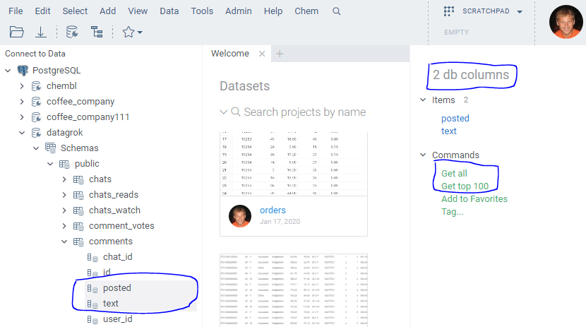

<!-- TITLE: DB Exploration -->
<!-- SUBTITLE: -->

# DB Exploration

Grok supports visual exploration of relational databases for some of the database providers, including
PostgreSQL, MySQL, MS SQL, Maria DB, and Oracle. If a provider supports it, you'll see 'Browse schema'
command for the corresponding connection:

## Schema browser

Schema browser visualizes all tables with all columns at once, giving you a high-level overview of the
database. Click on a table to see its details in the property panel; it is also a good starting point
for drill-downs and further exploration. The following quick actions are there:

## Hierarchy browser

Grok lets you visually explore both database schema and database content. Simply click
on the item (such as connection, table, or column) in the "File | Connect to data" pane to bring up
item's properties in the [property panel](property-panel.md). 

  

## Tips and tricks

### Context actions for db columns

In case you want to retrieve only some of the columns, select them (Shift+click) in the schema, and then
use context actions that appear in the property panel

### Videos

<iframe width="560" height="315" src="https://www.youtube.com/embed/YJmSvh3_uCM" frameborder="0" allow="accelerometer; autoplay; encrypted-media; gyroscope; picture-in-picture" allowfullscreen></iframe>

See also:
* [DB Visual Query](db-visual-query.md)
