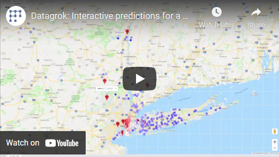
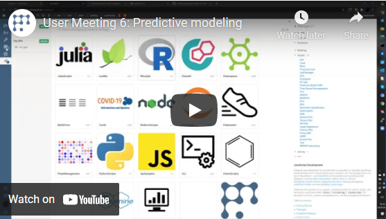

<!-- TITLE: Predictive modeling -->
<!-- SUBTITLE: -->

# Predictive modeling

Predictive modeling uses statistics to predict outcomes.

## Algorithms

Predictive models can be used either directly to estimate a response (outcome) given a defined 
set of characteristics (features), or indirectly to drive the choice of decision rules.

Plugin uses following types of kernels:
  * [R Caret](https://topepo.github.io/caret/index.html) 
  * [H2O](http://h2o.ai)
  * [Chemprop](https://github.com/chemprop/chemprop)
  
  
To select kernel open **Tools** | **Settings...** | **Servers** 

Set **Use Open Cpu For Predictive Modeling** to use R Caret, H2O will be used instead.

### Available models

For Caret:

| Method    | Model                                                     |
|-----------|-----------------------------------------------------------|
| rf        | Random Forest                                             |
| gbm       | Stochastic Gradient Boosting Machine                      |
| svmLinear | Support Vector Machines with Linear Kernel                |
| svmRadial | Support Vector Machines with Radial Basis Function Kernel |

For H2O:

| Method                       | Model                           |
|------------------------------|---------------------------------|
| Auto ML                      | Automatic model builder choosing optimal from GLM, DRF, GBM or DeepLearning |
| Deep Learning                | Deep Learning (Neural Networks) |
| Distributed Random Forest    | DRF                             |
| Generalized Linear Model     | GLM                             |
| Gradient Boosting Machine    | GBM                             |
| Naive Bayes Classifier       |                                 |
| K-Means Clustering           |                                 |
| Principal Component Analysis | PCA                             |

Note: "K-Means Clustering" and "Principal Component Analysis" do not require prediction column since 
provides only output. 

## Train model

Example for R Caret engine:
  * Open table
  * Run from menu: **Tools** | **Predictive modeling** | **Train**
  * Set model name
  * Select table that contains features
  * Select feature columns
  * Select outcome column
  * Set checkbox to impute missing values, if required
  * Set number of nearest neighbours to predict missing values, if required
  * Select modeling method. See **Available classification models** for description
  * Set percentage of train rows from table rows, 0.1..100
  * Run model training

## Apply model

  * Open table
  * Run from menu: **Tools** | **Predictive modeling** | **Apply**
  * Select table that contains features
  * Select applicable model
  * Set checkbox to impute missing values, if required
  * Set number of nearest neighbours to predict missing values, if required
  * Apply model
  
Also apply model available through "Models Browser" (**Tools** | **Predictive modeling** | **Browse Models**) 
or as suggested models in table properties in [Toolbox](../overview/navigation.md#toolbox) or [Property Panel](../overview/navigation.md#properties). 

## Outputs

### Outcome

Result of modelling (train or apply) will be concatenated to source table as column with name "Outcome".

### Roc curve

Receiver operating characteristic curve, i.e. ROC curve, is a graphical plot that illustrates the diagnostic 
ability of a binary classifier system as its discrimination threshold is varied.  
  
The ROC curve is created by plotting the true positive rate (TPR) against the false positive rate (FPR) at various 
threshold settings. The true-positive rate is also known as sensitivity, recall or probability of detection in 
machine learning. The false-positive rate is also known as the fall-out or probability of false alarm and can be 
calculated as (1 - specificity). The ROC curve is thus the sensitivity as a function of fall-out.  
  
ROC analysis provides tools to select possibly optimal models and to discard suboptimal ones independently from 
(and prior to specifying) the cost context or the class distribution. ROC analysis is related in a direct and 
natural way to cost/benefit analysis of diagnostic decision making.  
  
### Confusion matrix

Confusion matrix, also known as an error matrix, is a specific table layout that allows visualization of the
performance of an algorithm, typically a supervised learning one (in unsupervised learning it is usually called 
a matching matrix). Each column of the matrix represents the instances in a predicted class while each row 
represents the instances in an actual class (or vice versa). The name stems from the fact that it makes it
easy to see if the system is confusing two classes (i.e. commonly mislabelling one as another).  
  
It is a special kind of contingency table, with two dimensions ("actual" and "predicted"), and identical 
sets of "classes" in both dimensions (each combination of dimension and class is a variable in the contingency table).  

## Deployment

By itself, building a good model typically does not have a lot of value, but sharing the gained knowledge does. 
Even if the purpose of the model is to increase knowledge of the data, the knowledge gained will need to be organized 
and presented in a way that the customer can use it. Depending on the data and on the requirements, the
results could be presented as a data table, a report, an interactive visualization, or something else.

Datagrok platform was specifically designed with that in mind. In addition to traditional model deployment
techniques such as table and reports, Datagrok offers a unique way of distributing predictive model results via
the [data augmentation](../discover/data-augmentation.md) 
and [info panels](../discover/info-panels.md#predicting-molecule-solubility). 

### Videos

See also: 

* [Cheminformatics predictive modeling](../domains/chem/chem-predictive-modeling.md) 
* [Predictive modeling](https://en.wikipedia.org/wiki/Predictive_modelling)
* [Statistical classification](https://en.wikipedia.org/wiki/Statistical_classification)
* [R Caret package](https://topepo.github.io/caret/index.html)
* [H2O](http://h2o.ai/)
* [Chemprop](https://github.com/chemprop/chemprop)
* [Receiver operating characteristic (ROC)](https://en.wikipedia.org/wiki/Receiver_operating_characteristic)
* [Confusion matrix](https://en.wikipedia.org/wiki/Confusion_matrix)
* [Samples](https://public.datagrok.ai/js/samples/domains/data-science/predictive-model)
