<!-- TITLE: Navigation -->
<!-- SUBTITLE: -->

# Navigation
 Datagrok helps you unlock the full value of your organization's data by empowering any non-technical user to **discover, cleanse, visualize, explore, model data, and share the results** seamlessly. 

 To get started, go to [Datagrok](https://datagrok.ai/) and click on the  button.
## Welcome
<!-- Note: this section should be on https://datagrok.ai/help/overview/welcome-view -->

Once you log in on Datagrok, you will see the welcome screen. At the **top**, you will find a toolbar with menus to import data (there are over 30 connectors to the main databases, go to _**File > Connect to Data**_). 
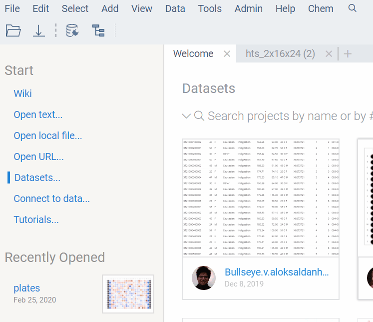

At the **left**, there is a toolbox with info to get started with some useful links, such as: _Wiki, Connect to Data, and even Tutorials_.

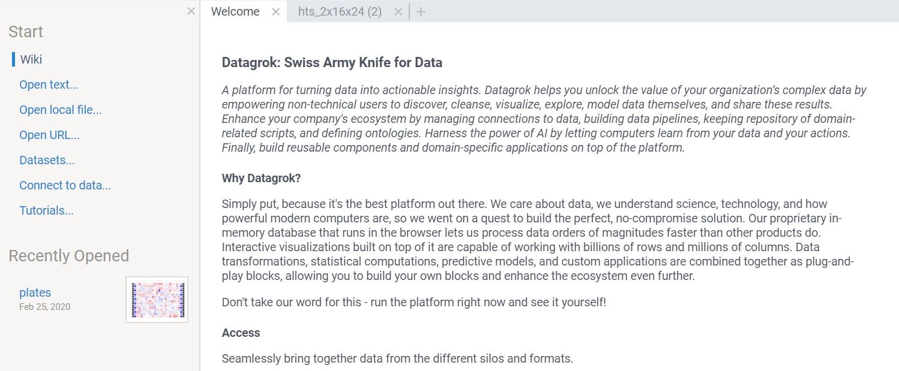

**Useful Links:** [Tutorials](../_internal/tutorials/tutorials.md) · [Scripting Tutorials](../_internal/tutorials/scripting.md) · [Function Parameters](../overview/functions/func-params-enhancement.md) · [Use Case: Navigation](../_internal/tutorials/platform-navigation.md)

At the **right**, you will find the property panel and the contextual help panel, which add useful information based on the selected items and the available features at a given moment.

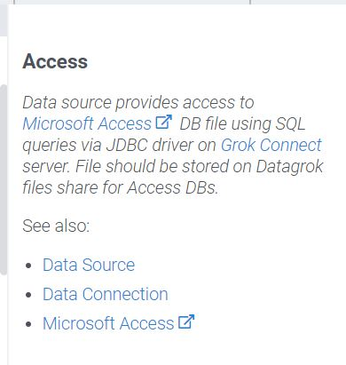

<!-- Note: add background to image so that it looks centered. -->
## Datasets

<!-- Note: so far, there is only (linkable) information on public datasets: https://datagrok.ai/help/access/public-datasets
Need to expand https://datagrok.ai/help/overview/toolbox
Also, need info for Contextual Help
-->

When you select a **Dataset**, you will see the a similar screen to the following. From left to right, relevant features appear on the [Toolbox](../overview/toolbox.md), the data is represented in the [Main View](../visualize/view-layout.md), and additional info on the data shows up on the [Property Panel](../features/property-panel.md) and the Contextual Help Panel.
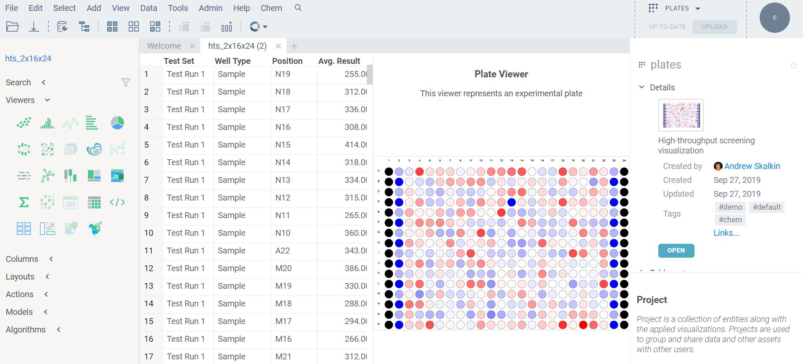

**Useful Links:** [Viewers](../viewers/viewers.md) · [Toolbox](../overview/toolbox.md) · [Main View](../visualize/view-layout.md) · [Property Panel](../features/property-panel.md)

### Workspace, Panels and Views

The Datagrok platform is fully browser-oriented and suitable for desktop devices. You can import your data into the workspace. Depending on the data, you will see suitable features available to use in your workspace. The fatures are organized in panels to be accesible, namely from left to right the main elements are: **toolbox, main view,** and **property panel**.
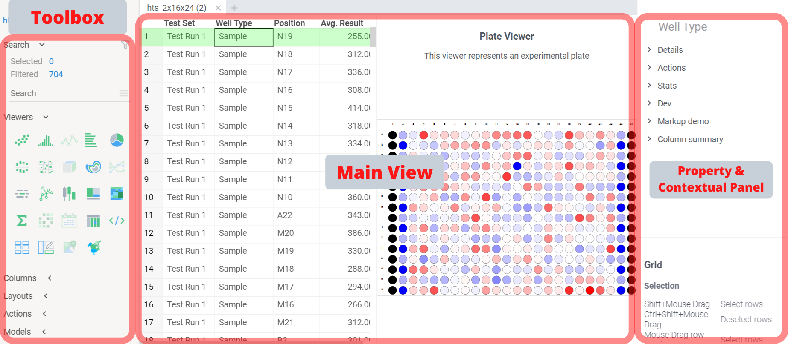

<!-- **_Note: Consider another layout for labels in the picture._** -->

##### Customizing Panels
Panels can be relocated for major convenience by using the _drag and drop_ principle. Also, all panels can be turned ON or OFF: 
* By clicking on the **X** sign on the top right corner, 
* By using shortcuts (**_Toolbox > Alt + X, Workspace: Alt + W, etc._**), 
* Or through the toolbar View menu: **_View > Toolbar, View > Properties, etc._**

#### Toolbar
The toolbar provides the main features that are available at a given moment. A view resides in the center and occupies all available area in the screen. There are some static controls, such as **File > Import File**, and controls that are specific for the active view.

**Useful Links:** [Workspace](../overview/workspace.md) · [Navigation](../features/navigation.md) · [Toolbox](../overview/toolbox.md)
#### Main Menus
The static menus offer basic functionalities that are common to all the environments. Moreover, some view specific menus appear when data is imported. At any moment, only the usable features appear as clickable.

#### Ribbons
The ribbons menu is a quick access icon toolbar located under the static and view-specific menus. Before you import or connect to data, the available options are **Open/Save local file, Connect to Data,** and **Show Workspace**.

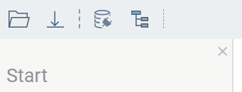

However, the quick access ribbons change depending on the available options. For instance, these are the features when you have already imported data to the workspace.

**Useful Links:** [Navigation](../features/navigation.md) · [Toolbox](../overview/toolbox.md)

### Toolbox
The toolbox, located on the left, contains controls that are specific to the current active view.

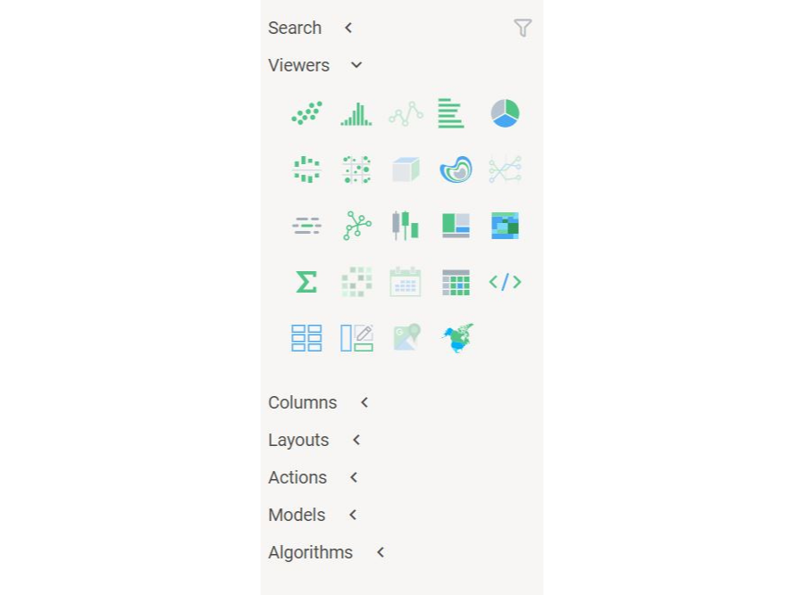

For more information check [Toolbox](../overview/toolbox.md). Below, you can find a review of the toolbox features.
#### Search
When data is imported, you can quickly filter and select rows using this feature of the toolbox. 
For more information, see: [Search Data](../explore/data-search.md) · [Search Patterns](../explore/data-search-patterns.md) · [Smart Search](../explore/data-search-patterns.md)
#### Viewers 
The view is the main element in the workspace. The data is listed and represented on this panel, which is usually located at the center. Use this feature to change the representation (view) of the data. _Please, note that only relevant views are available depending on the imported data._
For more info on viewers, see [Viewers](../viewers/viewers.md). For detailed info on each viewer, check these entries:
*   [3D Scatter Plot](../viewers/3d-scatter-plot.md)
*   [Bar Chart](../viewers/bar-chart.md)
*   [Calendar](../viewers/calendar.md)
*   [Filters](../viewers/filters.md)
*   [Histogram](../viewers/histogram.md)
*   [Pie Chart](../viewers/pie-chart.md)
*   [Statistics](../viewers/statistics.md)
*   [Viewers Host](../viewers/viewer-host.md)

<!-- Note: need to add more info in the viewer posts. -->

#### Columns
Use this feature to browse within the columns of the imported data quickly. For more information, see [Column Manager](../explore/column-manager.md).
#### Layouts 
Use this feature to **Save** the current layout of the data, i.e. view and other features. You may receive suggestions in relation to other users who used similar data. 

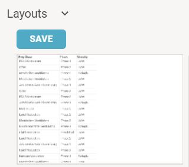

<!-- Note: Consider changing picture -->

Whenever you save a view layout, you will be able to repeat the representations for the same data or a new dataset easily. You can also use this feature to browse within your saved layouts to try different views for the data in seconds. For more information, see [View Layout](../visualize/view-layout.md).
#### Actions
Use this feature to perform key actions on the workspace, such as **Save as CSV, Save as Project, Clone, etc.** 
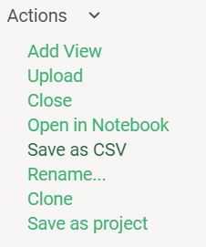
#### Models 
Use this powerful feature to train a model for your data. Once you have trained the model, you will be able to make predictions on the same or similar data. 

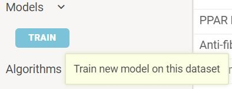

**Useful Links:** [Cheminformatics Predictive Modeling](../domains/chem/chem-predictive-modeling.md) · [Use Case Predictive Modeling](../_internal/tutorials/predictive-modeling.md) · [Predictive Modeling Info](../learn/predictive-modeling-info.md)
#### Tutorials
* [Use Case: Predictive Modelling](../_internal/tutorials/predictive-modeling.md)
### Algorithms
When available, this feature serves to train an algorithm on the dataset to get valuable insight or calculations done. An example is applied in the missing values imputation, for more info see [Missing Values Imputation](../transform/missing-values-imputation.md) and [Sample Script](https://public.datagrok.ai/js/samples/domains/data-science/missing-values-imputation) on the topic.

### Main View
The main viewer is the central panel where you can separate datasets and graphs in tabs.
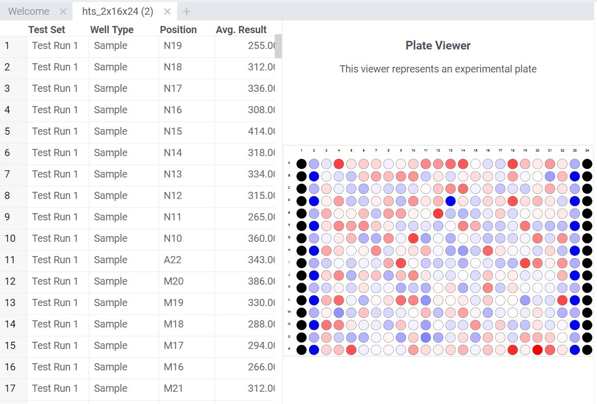
For more information, see [Viewers](../viewers/viewers.md).
#### Workspace
A Workspace is the collection of currently opened projects. The workspaces are separated by tabs in the main view. **Useful Links:** [Workspace](../overview/workspace.md)
### Property Panel
At the right, the property panel displays relevant information on the selected data of the dataset. You can perform some basic actions from this panel, such as _delete, filter, keep, or extract rows_.
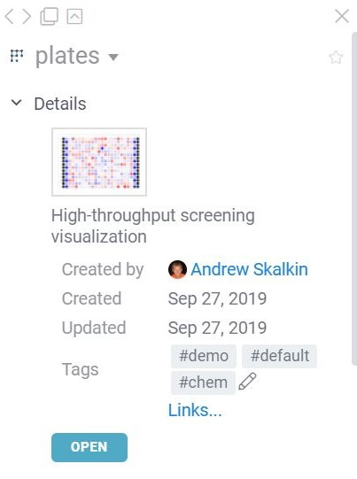

For more information, see: [Property Panel](../features/property-panel.md).
### Contextual Help Panel
The contextual help panel shows the additional insight for the specific situation or about the current selected object. 

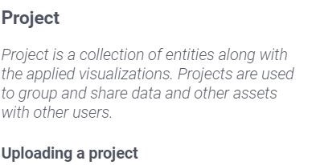

See also:
 * [Workspace](../overview/workspace.md) 
 * [Smart Search](../overview/smart-search.md) 
 * [Toolbox](../overview/toolbox.md) 

<!-- ##### Notes -->
<!-- * Emphasis on data analysis view > table view -->
<!-- * Website view for data analysis  -->
<!-- * One page about how you navigate on the system, dock &  undock -->
<!-- * Selecting data in multiple views > navigate back and forth, etc. -->