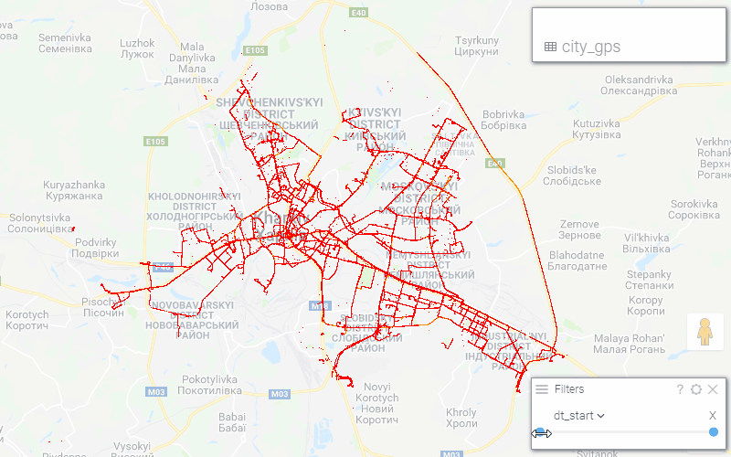

<!-- TITLE: Google Map Viewer -->
<!-- SUBTITLE: -->

# Google Map Viewer

Google Map Viewer overlays latitude/longitude data from the corresponding table
on top of the Google Map. 

By default, the map would pick up columns named "lon" / "lat", or "longitude" / "latitude".
Open map settings to specify two columns that represent longitude and latitude. To
control marker settings, click on the hamburger menu and select "Marker settings". 

In case the dataset contains geographical data (such as addresses), but does not
contain longitude and latitude coordinates, you might want to extract coordinates using
one of the [geographical functions](/functions?q=%23geo), 
such as #{cmd(AddressToCoordinates)}.

## Videos

<iframe width="560" height="315" src="https://www.youtube.com/embed/7MBXWzdC0-I?start=3392" frameborder="0" allow="accelerometer; autoplay; clipboard-write; encrypted-media; gyroscope; picture-in-picture" allowfullscreen></iframe>
   
See also: 
  
* [Geographical functions]()
* #{cmd(AddressToCoordinates)}
* #{cmd(IpToCoordinates)}
* #{cmd(AddressToCoordinates)}
* [Viewers](../viewers.md)
* [Table View](../../overview/table-view.md)
* [JS API: Google Map](https://public.datagrok.ai/js/samples/ui/viewers/types/google-map)