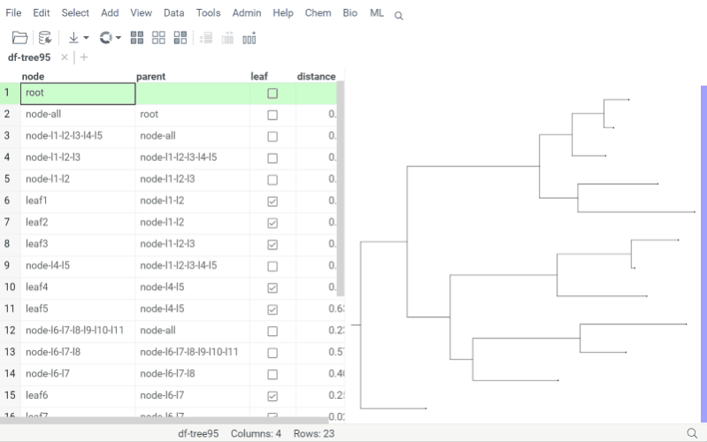
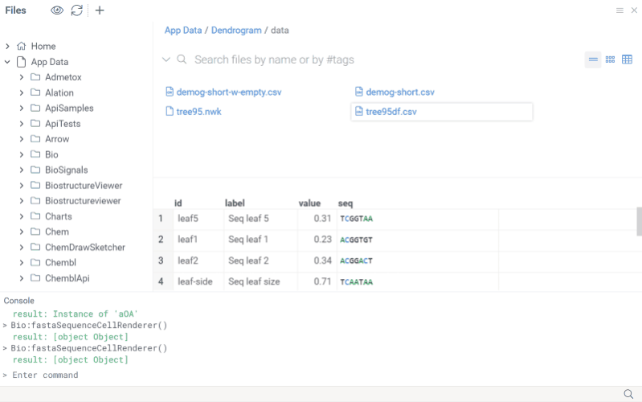
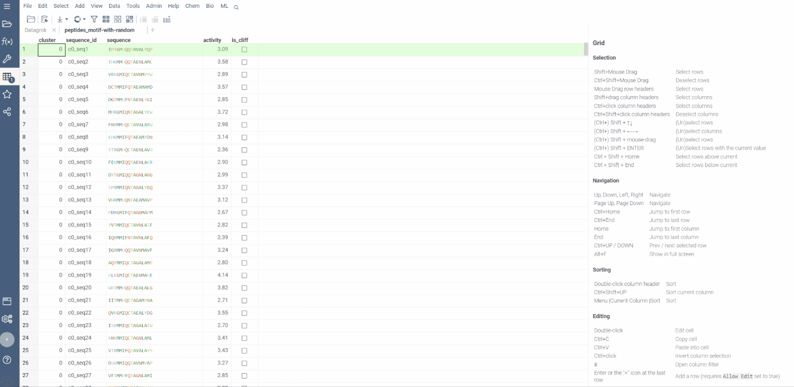
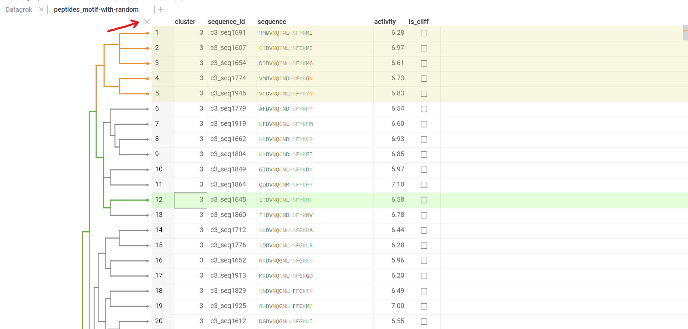
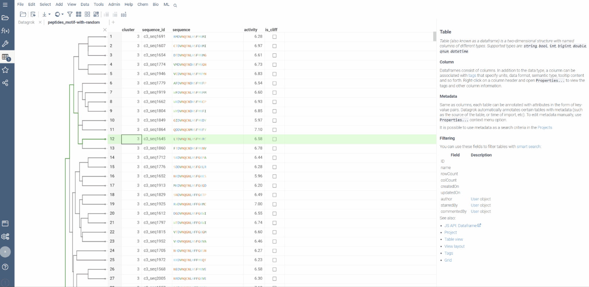

# Dendrogram

_Dendrogram_ is a [package](https://datagrok.ai/help/develop/develop#packages) for the [Datagrok](https://datagrok.ai)
platform for phylogenetic trees visualization.

## Notations

Now only the _Newick_ tree format is supported.

## Viewers

[Dendrogram viewer](./src/viewers/dendrogram.ts) is a pure typescript component derived from
[DG.JsViewer](../../js-api/src/viewer.ts) to be used as [a Datagrok viewer](../../help/visualize/viewers/viewers.md).
Exposed properties allow customizing the viewer appearance for the line width and color, the node size and fill color.



The viewer expects a data frame with the tag '.newick' (data frame tree data tag name can be customized with the
property 'newickTag') containing tree data, but also allowing to set the 'newick' property for data (the 'newick'
property value has higher priority over data frame tag).

```
//name: Dendrogram
//language: javascript
const csv = await grok.dapi.files.readAsText("System:AppData/Dendrogram/data/tree95df.csv");
const newick = await grok.dapi.files.readAsText("System:AppData/Dendrogram/data/tree95.nwk");
const df = DG.DataFrame.fromCsv(csv);
df.setTag('.newick', newick);
const tv = grok.shell.addTableView(df);
const viewer = await df.plot.fromType('Dendrogram', {});
tv.dockManager.dock(viewer, DG.DOCK_TYPE.RIGHT); // TypeError: Cannot read properties of undefined (reading 'H')
```

## Optimized for large trees

The Dendrogram viewer is highly optimized to render trees with hundreds of thousands of nodes.


## File handlers

Opening file with .nwk, .newick extension will be transformed to a DataFrame of nodes (node, parent, leaf, distance
columns) with a DendrogramViewer docked on the right side of the grid. The dendrogram viewer interacts with the data
frame on which it is opened on the column with the node names specified in the Node[ColumnName] property. Current state,
hover, and selection are supported and displayed with specific styles in the dendrogram and data frame grid.



## Dendrogram injected to grid, hierarchical clustering

An application developer can inject Dendrogram viewer to a grid linked by row number or leaves' column name.
For example Top menu function ML | Hierarchical Clustering calculates the tree on selected features/columns set with
specified pairwise distance metric and aggregation method. Mouse over, current, selected and filtered states, row height
are synchronized between grid and injected tree in both directions.


Hierarchical clustering supports numeric columns, as well as Macromolecule columns and combination of those. Different distance functions will be used depending on the type of macromolecule. Levenstein distance for DNA/RNA/Unknown, Needleman-Wunsch for Proteins and Hamming for pre-aligned columns. Distance matrix calculation is paralellized on web-workers, which yields very fast and efficient compute times. Hierarchical clustering is performed in web-assembly and supports multiple linkage methods, like `ward`, `average`, `centroid`, `complete`, `single`, `weighted` and `median`. For dataset of 2000 sequences, it takes less than 2 seconds to calculate the tree and render it.



There is also an option to close the dendrogram viewer and restore the original grid view, by clicking on the `X` button on the top rigth corner of the tree view.



When clustering is performed, the tree aplies its own sorting to the table. Therefore, any external sorting will not be alowed. If however, the user wants to sort the table by a specific column, the tree viewer will be hidden, and a message will be displayed to the user. From there, the user can either restore sorting and continue working with the tree, or click on the `X` button to close the tree and restore the original grid view.

